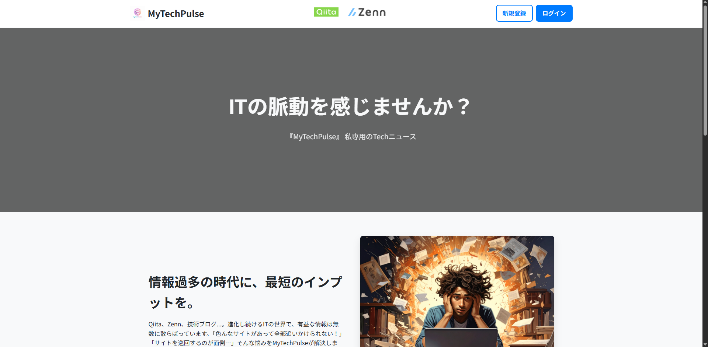
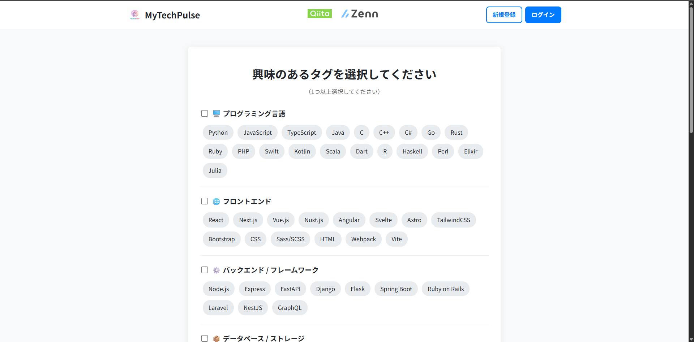

# 「MyTechPulse」ー私専用のTechニュースー

## Your daily does of tech：パーソナライズされた技術情報の躍動をあなたに。

MyTechPulseは、「色んなサイトがあって全部追いかけられない」、「サイトを巡回するのが面倒」といった悩みを解決するために生まれました。

<div origin= center>
    
</div>

### What MyTechPulse does
複数の技術メディアやブログから情報を自動収集。あなたの過去の閲覧傾向や興味関心を分析し、膨大な情報の中から「あなたに最適化された技術の脈動」を届けます。
- **情報の集約**: 主要な技術サイトを巡回する手間をゼロに。
- **パーソナライズ**: 読めば読むほど、あなたの好みに合った記事が優先的に届きます。
- **効率的なキャッチアップ**: 隙間時間で、今知るべきトレンドを効率よく把握。

## 技術スタック


## SETUP
### 方法A: Docker（推奨）
1. [最新のZIPファイルをダウンロード](https://github.com/H4aruki/MyTechPulse/archive/refs/heads/main.zip) し、任意のフォルダに展開（解凍）してください。
2. `.env` の準備
   ```bash
   cp backend/.env.example backend/.env
   ```
   `backend/.env` を開き、`QIITA_ACCESS_TOKEN`（[Qiitaの設定画面](https://qiita.com/settings/applications)で発行）を設定してください。`DATABASE_URL` はDocker起動時に自動でDBコンテナ向けに上書きされるため変更不要です。
3. 起動
   ```bash
   docker compose up --build
   ```
   `http://127.0.0.1:8000` でAPIが起動します。
4. フロントエンドを起動
   ```bash
   cd frontend
   npm install
   npm run dev
   ```
   `http://localhost:5173` でフロントエンドが起動します。

### 方法B: ローカル環境（XAMPP）
#### 1. 事前準備
以下のツールがインストールされ、起動していることを確認して下さい。

・Python3.10以上

・XAMPP（コントロールパネルからMYSQLを「Start」しておいてください。）

#### 2. 環境構築
1. [最新のZIPファイルをダウンロード](https://github.com/H4aruki/MyTechPulse/archive/refs/heads/main.zip) し、任意のフォルダに展開（解凍）してください。

2. 必要ライブラリのインストール
   ```bash
   pip install -r requirements.txt
   ```
3. `.env` の準備
   ```bash
   cp backend/.env.example backend/.env
   ```
   `backend/.env` を開き、`QIITA_ACCESS_TOKEN`（[Qiitaの設定画面](https://qiita.com/settings/applications)で発行）を設定してください。
4. データベースの構築
   ```bash
   cd backend
   python init_db.py
   ```
#### 3. システムの起動
APIを起動します。
   ```bash
   uvicorn app.main:app --reload
   ```
別のターミナルでフロントエンドを起動します。
   ```bash
   cd frontend
   npm install
   npm run dev
   ```
`http://localhost:5173` をブラウザで開いてください。

## Features/Roadmap
- [ ] Xの記事の追加
- [ ] Zennのパーソナライズ化
- [ ] キーワード検索
- [ ] ダークモード対応
- [ ] ブックマーク
- [ ] 既読管理
- [ ] AI要約機能
- [ ] 自動カテゴリ分類
- [x] Dockerの導入

## Gallery
### メインページ


### タグ選択



## Contributors ✨
<table>
    <tr>
        <td align="center">
            <a href="https://github.com/H4aruki">
                <br />
                <sub><b>H4aruki</b></sub>
            </a><br />
            <a href="https://github.com/H4aruki/MyTechPulse/commits?author=H4aruki" title="Code">💻</a>
            <a href="https://github.com/H4aruki/MyTechPulse/commits?author=H4aruki" title="Construction">🚧</a>
            <a href="https://github.com/H4aruki/MyTechPulse/commits?author=H4aruki" title="Design">🎨</a>
        </td>
        <td align="center">
            <a href="https://github.com/KaichoHarry">
                <br />
                <sub><b>はりぃ会長</b></sub>
            </a><br />
            <a href="https://github.com/H4aruki/MyTechPulse/commits?author=KaichoHarry" title="Code">💻</a>
            <a href="https://github.com/H4aruki/MyTechPulse/commits?author=KaichoHarry" title="Construction">🚧</a>
            <a href="https://github.com/H4aruki/MyTechPulse/commits?author=KaichoHarry" title="Ideas">🤔</a>
            <a href="https://github.com/H4aruki/MyTechPulse/commits?author=KaichoHarry" title="Design">🎨</a>
        </td>
    </tr>
</table>


