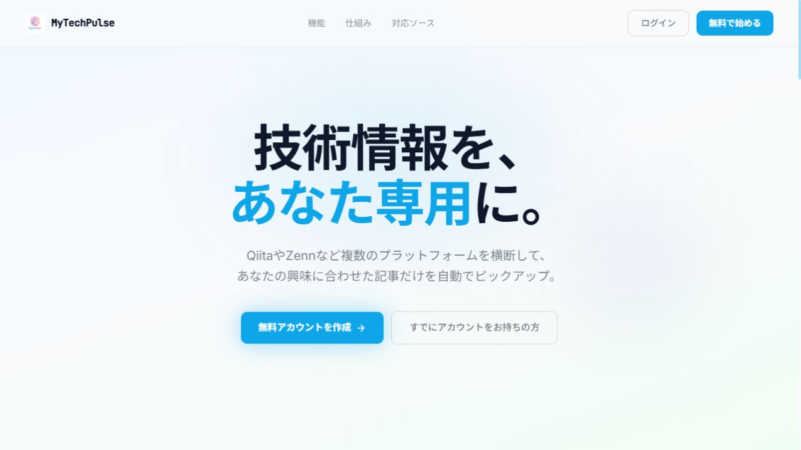
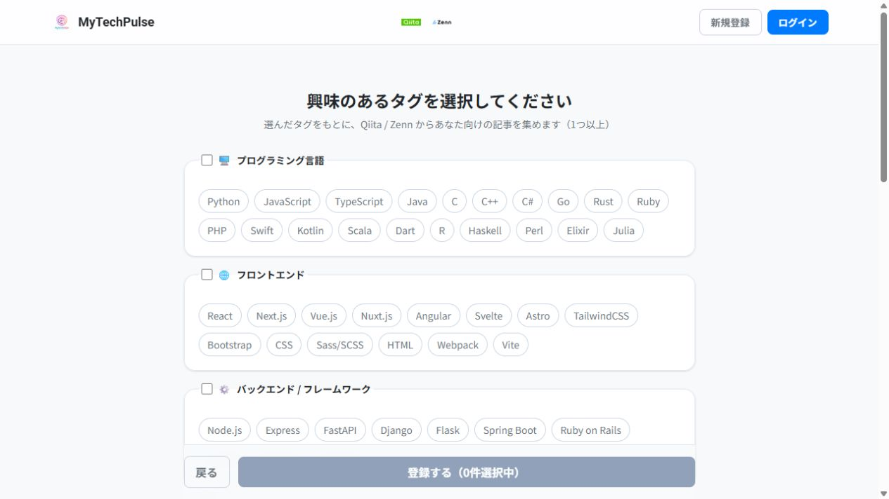
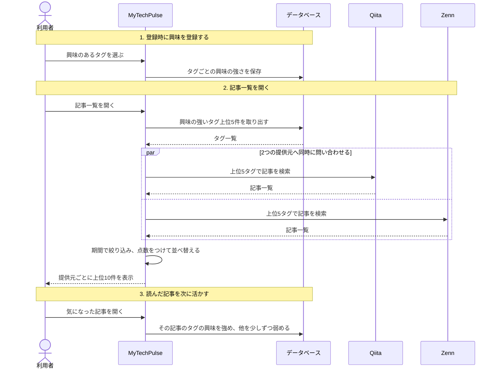

# MyTechPulse

> Qiita・Zennから、興味に合う技術記事を集めるパーソナライズニュースアプリ

[公開版を試す](https://mytechpulse.net) ・ [機能一覧](./docs/BasicDesignSpecifications/FeaturesList.md) ・ [コントリビューションガイド](./CONTRIBUTING.md)

MyTechPulseは、複数の技術情報サイトを巡回する手間を減らし、短い時間で必要な記事を見つけるためのWebアプリです。登録した興味タグと記事の閲覧傾向をもとに、Qiita・Zennの新しい記事を優先度順に表示します。

## 使ってみる

**https://mytechpulse.net**

ブラウザから、そのまま使えます。インストールは不要です。

## 主な機能

- ユーザー登録・ログイン（JWT認証）
- カテゴリ別の興味タグ選択と一括選択
- 興味の強い上位5タグを使ったQiita・Zennの記事取得
- 提供元ごとに最大10件の記事を表示
- 興味度をもとにした並べ替え（Qiitaの記事は反響の大きさも加味）
- 記事クリックを次回以降のおすすめへ反映
- 読み込み中・取得失敗・記事がない場合の状態表示

詳しい実装状況は[機能一覧](./docs/BasicDesignSpecifications/FeaturesList.md)を参照してください。

## Gallery

### サービス紹介ページ

### 興味タグの選択

## 仕組み

記事は画面を開くたびに外部サイトから取得します。読んだ記事のタグが興味の傾向へ反映され、次に開いたときの並び順が変わります。

```mermaid
sequenceDiagram
    actor User as 利用者
    participant App as MyTechPulse
    participant DB as データベース
    participant Qiita as Qiita
    participant Zenn as Zenn

    Note over User,DB: 1. 登録時に興味を登録する
    User->>App: 興味のあるタグを選ぶ
    App->>DB: タグごとの興味の強さを保存

    Note over User,Zenn: 2. 記事一覧を開く
    User->>App: 記事一覧を開く
    App->>DB: 興味の強いタグ上位5件を取り出す
    DB-->>App: タグ一覧
    par 2つの提供元へ同時に問い合わせる
        App->>Qiita: 上位5タグで記事を検索
        Qiita-->>App: 記事一覧
    and
        App->>Zenn: 上位5タグで記事を検索
        Zenn-->>App: 記事一覧
    end
    App->>App: 期間で絞り込み、点数をつけて並べ替える
    App-->>User: 提供元ごとに上位10件を表示

    Note over User,DB: 3. 読んだ記事を次に活かす
    User->>App: 気になった記事を開く
    App->>DB: その記事のタグの興味を強め、他を少しずつ弱める
```

記事を集める期間の条件は提供元で異なります。Qiitaは直近5日、Zennは直近2週間を対象とし、該当するZenn記事が1件も無かった場合のみ、期間の条件を外して補います。

並べ替えの点数は、Zennが興味の強さの合計、Qiitaがそれに反響の大きさを掛けた値です。Zennは取得の時点で提供元のトレンド順に絞り込まれているため、反響を重ねて数えていません。

## 技術スタック

アイコンに無いものとして、ログイン状態の保持にJWT、パスワードの保護にbcrypt、本番環境のHTTPS化にCaddyを使っています。

構成の詳細は[システム構成図](./docs/BasicDesignSpecifications/SystemArchitectureDiagram.md)を参照してください。

## Roadmap

- 登録後の興味タグ変更
- 記事の日次一括取得とDB保存
- ブックマーク・既読管理
- キーワード検索
- ダークモード
- AI要約・自動カテゴリ分類
- 利用規約・プライバシーポリシー
- ログイン試行回数の制限とパスワード強度チェック
- バックアップの外部保管

優先順位と進捗は[TASKS.md](./TASKS.md)で管理しています。

## Contributors

<table>
  <tr>
    <td align="center">
      <a href="https://github.com/H4aruki">
         
        <b>H4aruki</b>
      </a>
    </td>
    <td align="center">
      <a href="https://github.com/KaichoHarry">
         
        <b>はりぃ会長</b>
      </a>
    </td>
  </tr>
</table>
