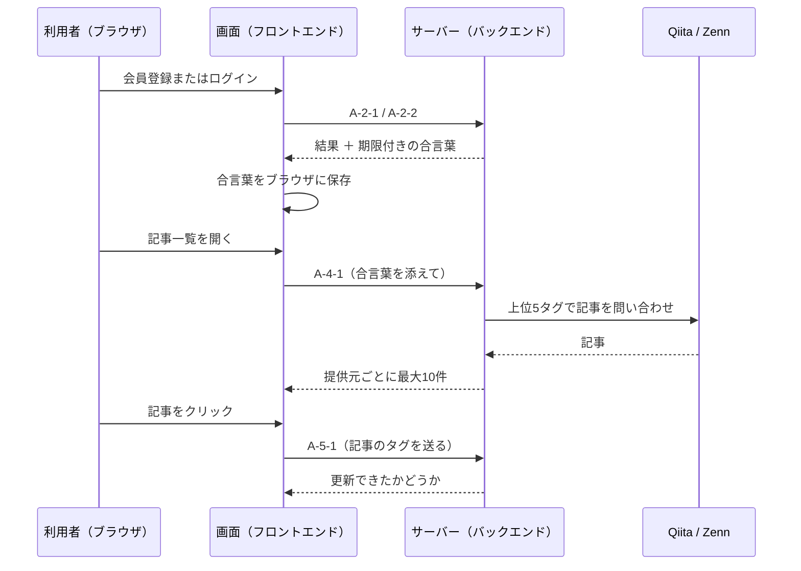

# APIの共通の決まりごと

すべての窓口に共通する取り決めをまとめたもの。窓口ごとの詳しい中身は[ApiList.md](ApiList.md)から各詳細ファイルをたどる。

## 1. 基本の取り決め

| 項目 | 内容 |
| --- | --- |
| 入口のアドレス | 開発中は`http://127.0.0.1:8000`。画面側は`frontend/.env`の設定値で切り替える |
| データの形式 | 送受信ともにJSON（UTF-8） |
| 送り方 | 動作確認用を除きすべてPOST。値はリクエストの本文（ボディ）に入れる |
| 本人確認 | 期限付きの合言葉を`Authorization: Bearer <合言葉>`という見出し（ヘッダー）に付けて送る |
| 結果の伝え方 | 通信そのものは成功扱い（200）にして、**本文の中の`status`という数値**で成否を表す |
| 呼び出しを許すサイト | あらかじめ許可したアドレスからのみ受け付ける（`backend/app/main.py`と`.env`の設定で指定） |

## 2. 結果を表す数値（status）

| 値 | 意味 |
| --- | --- |
| 1 | 成功 |
| 2 | 入力に起因する失敗（利用者名の重複、本人確認の失敗など） |
| 0 | サーバー内部での失敗、または該当データが1件も無い |

- それぞれの窓口で2や0が具体的に何を指すかは、各詳細ファイルに書いている
- この数値は画面側でも同じ意味で扱っている（`frontend/src/api/types.ts`）。意味を変えるときは必ず両方をそろえること

## 3. 本人確認のしくみ

- 会員登録・ログインに成功したときだけ、期限付きの合言葉をサーバーが発行して本文で返す
- 画面側はこれをブラウザに保存し、以降の「記事一覧」「クリックの記録」で見出しに付けて送る
- 有効期限は既定で24時間
- 期限が切れた合言葉や、そもそも合言葉が無い場合は、上の`status`の決まりごとの**例外**として通信自体を失敗（401）として返す
- サーバー側で合言葉を無効にするしくみは持っていない。ログアウトはブラウザ側で合言葉を消すだけ

本人確認が必要な窓口は、おすすめ記事の取得（A-4-1）と記事クリックの記録（A-5-1）の2つ。

## 4. 呼び出しの流れ

## 5. 動作確認（A-0-1）

サーバーが起きているかどうかを確かめるためだけの窓口。詳細ファイルを設けず、ここに記載する。

| 項目 | 内容 |
| --- | --- |
| 方式・パス | GET `/` |
| 本人確認 | 不要 |
| 送るもの | なし |
| 返るもの | `{"Hello": "World"}` |

この窓口だけは`status`の決まりごとの対象外で、決まった文言をそのまま返す。
