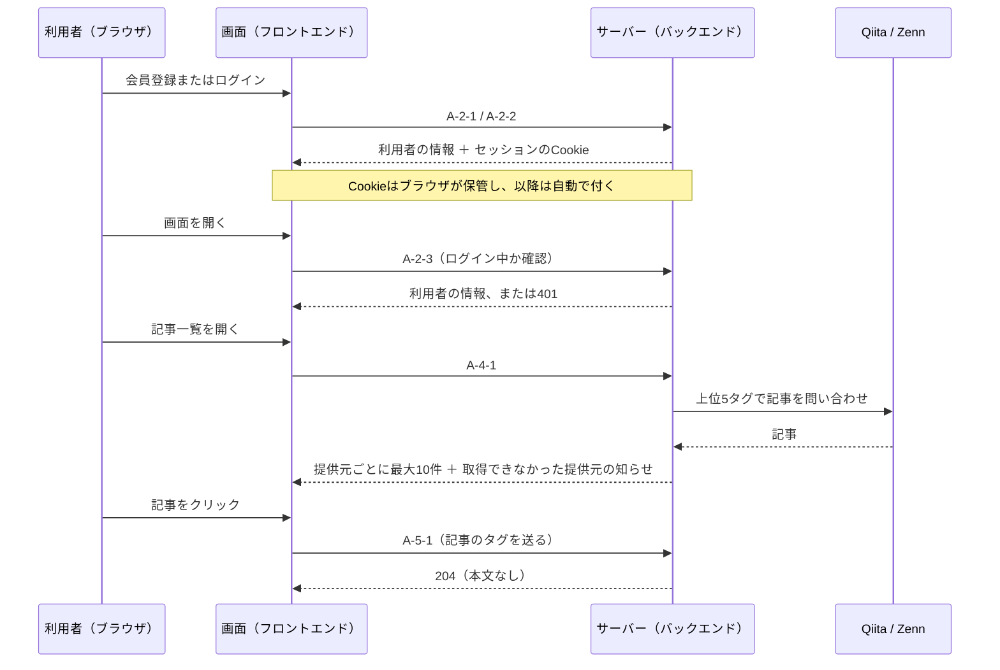

# APIの共通の決まりごと

すべての窓口に共通する取り決めをまとめたもの。窓口ごとの詳しい中身は[ApiList.md](ApiList.md)から各詳細ファイルをたどる。決定の理由は[ADR 0002（サーバー側の認証セッション）](../../adr/0002-use-server-side-sessions.md)にある。

## 1. 基本の取り決め

| 項目 | 内容 |
| --- | --- |
| 入口のアドレス | 開発中は`http://localhost:8001`（画面と同じ`localhost`にそろえる。`127.0.0.1`だとCookieが付かない）。画面側は`frontend/`の`VITE_API_BASE_URL`で切り替える |
| データの形式 | 送受信ともにJSON（UTF-8）。エラーだけは`application/problem+json` |
| 送り方 | 読むだけの窓口はGET、書き込みや状態が変わる窓口はPOST。値はPOSTでは本文（ボディ）に入れる |
| 本人確認 | ログインで発行されるCookie（HttpOnly）を、ブラウザが自動で付けて送る。画面側のプログラムは中身に触れない |
| 結果の伝え方 | **HTTPステータス**で成否を表す。失敗の中身は本文の`code`（機械が判定する名前）と`detail`（利用者向けの説明）で伝える |
| 呼び出しを許すサイト | あらかじめ許可したアドレスからのみ受け付ける（環境設定の`CORS_ALLOWED_ORIGINS`で指定。`*`は使えない） |

## 2. 結果の表し方

### 成功したとき

| ステータス | 意味 |
| --- | --- |
| 200 | 成功。本文に結果を入れて返す（ログイン、記事取得など） |
| 201 | 新しく作れた（会員登録） |
| 204 | 成功。返す本文はない（ログアウト、クリックの記録） |

### 失敗したとき

失敗は、本文に次の項目を持つ共通の形（Problem Details）で返す。

| 項目名 | 型 | 説明 |
| --- | --- | --- |
| type | 文字列 | 問題の種類。専用の種類が無いときは`about:blank` |
| title | 文字列 | ステータスの短い名前（例: `Unauthorized`） |
| status | 数値 | HTTPステータスと同じ値 |
| code | 文字列 | 機械が判定できる安定した名前（下表）。画面側の分岐はこれで行う |
| detail | 文字列 | 利用者向けの説明 |
| errors | 配列 | 入力項目ごとの指摘。`field`（項目名）と`message`（指摘）を持つ。入力チェックの失敗のときだけ入る |

| ステータス | code | 意味 |
| --- | --- | --- |
| 401 | `unauthenticated` | ログインしていない、またはセッションの期限が切れている |
| 401 | `invalid_credentials` | ログインの利用者名またはパスワードが違う。利用者がいない場合と区別しない |
| 403 | `origin_not_allowed` | 許可されていないサイトからの書き込み操作 |
| 403 | `csrf_header_required` | 書き込み操作に必要な専用ヘッダーが無い |
| 409 | `username_taken` | 会員登録で、その利用者名がすでに使われている |
| 422 | `validation_failed` | 入力の形や長さが決まりに合わない。`errors`に項目ごとの指摘が入る |
| 500 | `internal_error` | サーバー内部の失敗。原因は応答に出さない |
| 503 | `providers_unavailable` | 記事の取得先（QiitaとZenn）が両方とも使えない |
| 503 | `service_unavailable` | データベースに接続できない（`/health/ready`など） |

- 内部の失敗の原因、SQL、入力されたパスワードなどは、エラー応答に含めない
- 画面側は、401だけを「ログインし直し」として扱い、それ以外の失敗は`detail`を表示して再試行できるようにしている（`frontend/src/api/client.ts`）

## 3. 本人確認のしくみ

- 会員登録・ログインに成功すると、サーバーが推測できない乱数の合言葉（セッション）を作り、**Cookie**で渡す。本文には含めない
- Cookieは`HttpOnly`（画面側のプログラムから読めない）・`SameSite=Lax`・`Path=/`。本番では`Secure`が付き、名前は`__Host-mtp_session`（開発中は`mtp_session`）
- サーバーは合言葉そのものではなく、その**ハッシュ値**だけをデータベースに保存する。データベースが漏れても、そのまま使われない
- 有効期限は既定で24時間（`SESSION_TTL`）。期限が切れた合言葉や、そもそも合言葉が無い場合は、401（`unauthenticated`）を返す
- ログアウトは、サーバー側のセッションを削除し、Cookieを破棄する。ブラウザの手元で消すだけではない
- 本人確認が必要な窓口は、ログイン中の利用者の確認（A-2-3）、おすすめ記事の取得（A-4-1）、記事クリックの記録（A-5-1）の3つ

## 4. 他のサイトからの悪用を防ぐ決まり（CORSとCSRF）

画面（Cloudflare Pages）とサーバー（Lightsail）は別のアドレスにあるため、ブラウザは別サイト間の通信として扱う。そのうえでCookieを使うので、次の2つを守っている。

| 決まり | 内容 |
| --- | --- |
| 許可するサイトの限定 | `CORS_ALLOWED_ORIGINS`に書いたアドレスだけ、Cookie付きの通信を許す。許可していないサイトからの事前確認（preflight）は403で断る |
| 書き込み操作の二重確認 | POST（書き込み）には、許可されたサイトからのリクエストであること（`Origin`）に加えて、専用ヘッダー`X-MTP-CSRF: 1`を必須にしている。どちらかが欠けると403 |

- 読むだけのGETは、どちらの確認も要らない
- 画面側（`frontend/src/api/client.ts`）は、Cookieを送る設定と専用ヘッダーを、すべての呼び出しで自動で付けている

## 5. 呼び出しの流れ

```mermaid
sequenceDiagram
    participant U as 利用者（ブラウザ）
    participant F as 画面（フロントエンド）
    participant B as サーバー（バックエンド）
    participant E as Qiita / Zenn

    U->>F: 会員登録またはログイン
    F->>B: A-2-1 / A-2-2
    B-->>F: 利用者の情報 ＋ セッションのCookie
    Note over F,B: Cookieはブラウザが保管し、以降は自動で付く

    U->>F: 画面を開く
    F->>B: A-2-3（ログイン中か確認）
    B-->>F: 利用者の情報、または401

    U->>F: 記事一覧を開く
    F->>B: A-4-1
    B->>E: 上位5タグで記事を問い合わせ
    E-->>B: 記事
    B-->>F: 提供元ごとに最大10件 ＋ 取得できなかった提供元の知らせ

    U->>F: 記事をクリック
    F->>B: A-5-1（記事のタグを送る）
    B-->>F: 204（本文なし）
```

## 6. 動作確認（A-0-1・A-0-2）

サーバーの状態を確かめるための窓口。詳細ファイルを設けず、ここに記載する。本人確認は不要で、公開の運用確認や自動公開の確認に使う。

| API ID | 方式・パス | 返るもの | 意味 |
| --- | --- | --- | --- |
| A-0-1 | GET `/health/live` | `{"status": "ok"}`（200） | サーバーのプロセスが動いている。データベースは見ない |
| A-0-2 | GET `/health/ready` | `{"status": "ok"}`（200）、失敗時は503 | データベースへ2秒以内に接続できる。失敗の原因は応答に出さない |

- 自動公開（[go-auto-deploy.md](../../deploy/go-auto-deploy.md)）は、公開直後にA-0-2を確認し、失敗したら前の版へ自動で戻す
- この2つは`/api/v1`の外にあり、結果の表し方も上記の共通の形ではなく、決まった本文を返す
