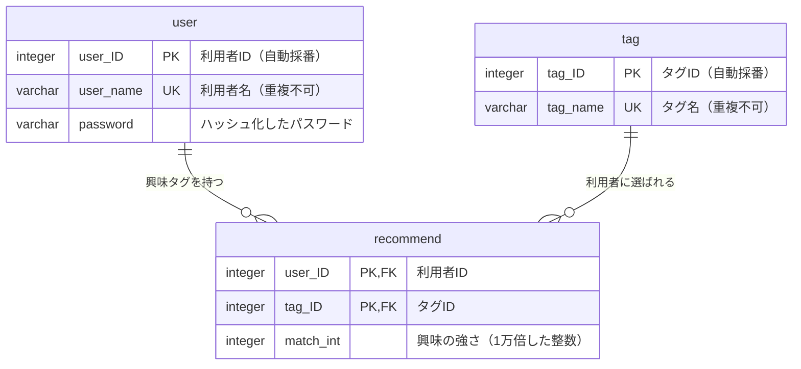

# データベース構成

MyTechPulseがデータを保存している場所（データベース）の構成をまとめたもの。実際の定義は`backend/app/models/`にあり、この文書はその内容を人が読める形に書き起こしている。

- データベースの種類: PostgreSQL 17（Dockerコンテナで起動する）
- データベース名: `mytechpulse`
- 文字の扱い: UTF-8
- テーブルの作成: `backend/init_db.py`が定義ファイルを読んで作る（何度実行しても同じ結果になる）
- 変更履歴を自動で管理するしくみ（マイグレーション）は導入しておらず、列を増やす・変えるときは定義ファイルを直したうえで作り直す運用になっている

## 1. テーブル一覧

| No | テーブル名 | 日本語名 | 役割 | 想定件数 |
| --- | --- | --- | --- | --- |
| 1 | user | 利用者 | 会員登録した人の名前とパスワードを保存する | 利用者数と同じ |
| 2 | tag | 技術タグ | 「Python」「React」などの技術分野の名前を保存する | 100件程度 |
| 3 | recommend | 興味の強さ | 「どの利用者が、どのタグに、どれくらい興味があるか」を保存する。利用者とタグを結びつける橋渡し役 | 利用者数 × 選んだタグ数 |

現在のテーブルは以上の3つのみ。記事そのものはデータベースに保存しておらず、表示のたびにQiita・Zennから取得している。

## 2. ER図

- 1人の利用者は複数のタグに興味を持てる
- 1つのタグは複数の利用者から選ばれる
- この「多対多」の関係を、間に挟んだ興味の強さテーブル（recommend）が表現している。単なる橋渡しではなく、組み合わせごとに「興味の強さ」という値を持つのが特徴

## 3. 主要テーブル定義

### 3-1. user（利用者）

会員登録した人の情報を保存する。

| 列名 | 型 | 必須 | 主キー | 一意 | 説明 |
| --- | --- | --- | --- | --- | --- |
| user_ID | integer | ○ | ○ | ○ | 利用者を識別する番号。登録時に自動で採番される |
| user_name | varchar(50) | ○ | | ○ | 画面で入力する利用者名。すでに使われている名前では登録できない |
| password | varchar(255) | ○ | | | パスワードを元に戻せない形に変換した文字列。入力されたそのままの文字列は保存しない |

- 利用者名が重複しない制約により、会員登録時の重複チェックが二重に担保される（画面側のチェックと、データベース側の制約）
- 登録日時・更新日時の列は現時点では持っていない

### 3-2. tag（技術タグ）

記事を探すときに使う技術分野の名前を保存する。

| 列名 | 型 | 必須 | 主キー | 一意 | 説明 |
| --- | --- | --- | --- | --- | --- |
| tag_ID | integer | ○ | ○ | ○ | タグを識別する番号。自動で採番される |
| tag_name | varchar(50) | ○ | | ○ | タグの名前（例: Python、React、Docker） |

- タグはあらかじめ全件を登録しておくのではなく、会員登録で選ばれたタグがまだ無ければその場で追加される方式になっている
- 記事のタグと突き合わせるときは大文字・小文字の違いを無視して比べる（`backend/app/services/news_service.py`）。ただしこの列自体は入力されたままの表記で保存されるため、表記だけが違う似たタグが並ぶ可能性がある

### 3-3. recommend（興味の強さ）

利用者とタグの組み合わせごとに、興味の強さを保存する。おすすめ機能の中核となるテーブル。

| 列名 | 型 | 必須 | 主キー | 外部キー | 説明 |
| --- | --- | --- | --- | --- | --- |
| user_ID | integer | ○ | ○ | user.user_ID | どの利用者かを指す |
| tag_ID | integer | ○ | ○ | tag.tag_ID | どのタグかを指す |
| match_int | integer | ○ | | | 興味の強さ。0〜1の小数を1万倍した整数で保存する |

- 主キーは利用者IDとタグIDの2つの組み合わせ。同じ利用者・同じタグの行が二重に作られることはない
- 利用者またはタグが削除されると、それに結びついた行も一緒に消える（連動削除）

#### 興味の強さの保存方法

計算上は0〜1の小数だが、小数のまま保存すると誤差が出るため、**1万倍して整数にしてから保存する**。

| 場面 | 変換 |
| --- | --- |
| 読み出すとき | 保存値 ÷ 10000 → 小数の重み |
| 保存するとき | 小数の重み × 10000 → 整数 |

この変換は`backend/app/services/`の各処理が行っている。変換を忘れると桁が1万倍ずれるため、この列を直接読み書きする処理を追加するときは注意が必要。

#### 値が変わるタイミング

| タイミング | 動き |
| --- | --- |
| 会員登録時 | 選ばれたタグの行を作る。このとき保存値には仮の初期値として1が入る |
| 記事クリック時 | その利用者の全タグの値を0.8倍に減らし、クリックした記事のタグにだけ0.2を足す（`backend/app/utils/scoring.py`） |

クリックのたびに古い興味が薄れ、最近読んだ分野が強まる。結果として、直近の関心に寄せたおすすめになる。

## 4. 補足

- 記事情報を保存するテーブルは無いため、表示のたびに外部サイトへ問い合わせが発生する。取得結果をデータベースに貯める案は`TASKS.md`で検討中
- 本番環境では毎日データのコピーを取り、7日分を保管している（要件定義書の非機能要件を参照）
