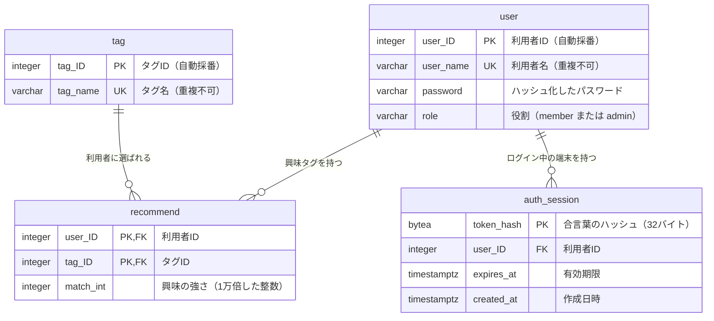

# データベース構成

MyTechPulseがデータを保存している場所（データベース）の構成をまとめたもの。実際の定義は`server/db/migrations/`（変更履歴の一式）にあり、この文書はその内容を人が読める形に書き起こしている。

- データベースの種類: PostgreSQL 17（Dockerコンテナで起動する）
- データベース名: `mytechpulse`
- 文字の扱い: UTF-8
- テーブルの作成・変更: マイグレーション（goose）で行う。`server/cmd/migrate`が、まだ適用していない変更を順に実行する。何度実行しても、適用済みのものは繰り返さない
- 本番へは「**追加するだけ**」の変更に限る。列や表の削除・名前変更などは、自動検査（`server/db/migrations/additive_test.go`）で止まる。API入れ替えに失敗して前の版へ戻ってもデータベースを巻き戻さずに済ませるため。詳細は`server/db/migrations/README.md`を参照
- 出発点（`00001_legacy_baseline`）は、Python版の時代から使ってきた3つのテーブルと同じ形。すでに同じ形のデータベースなら何も変えず、違いがあれば止まる

## 1. テーブル一覧

| No | テーブル名 | 日本語名 | 役割 | 想定件数 |
| --- | --- | --- | --- | --- |
| 1 | user | 利用者 | 会員登録した人の名前・パスワード・役割を保存する | 利用者数と同じ |
| 2 | tag | 技術タグ | 「Python」「React」などの技術分野の名前を保存する | 100件程度 |
| 3 | recommend | 興味の強さ | 「どの利用者が、どのタグに、どれくらい興味があるか」を保存する。利用者とタグを結びつける橋渡し役 | 利用者数 × 選んだタグ数 |
| 4 | auth_session | ログインのセッション | ログイン中の端末ごとの合言葉（のハッシュ）と有効期限を保存する | 同時にログインしている端末の数 |

現在のテーブルは以上の4つのみ。記事そのものはデータベースに保存しておらず、表示のたびにQiita・Zennから取得している。

## 2. ER図

```mermaid
erDiagram
    user ||--o{ recommend : "興味タグを持つ"
    tag  ||--o{ recommend : "利用者に選ばれる"
    user ||--o{ auth_session : "ログイン中の端末を持つ"

    user {
        integer user_ID PK "利用者ID（自動採番）"
        varchar user_name UK "利用者名（重複不可）"
        varchar password "ハッシュ化したパスワード"
        varchar role "役割（member または admin）"
    }

    tag {
        integer tag_ID PK "タグID（自動採番）"
        varchar tag_name UK "タグ名（重複不可）"
    }

    recommend {
        integer user_ID PK,FK "利用者ID"
        integer tag_ID PK,FK "タグID"
        integer match_int "興味の強さ（1万倍した整数）"
    }

    auth_session {
        bytea token_hash PK "合言葉のハッシュ（32バイト）"
        integer user_ID FK "利用者ID"
        timestamptz expires_at "有効期限"
        timestamptz created_at "作成日時"
    }
```

- 1人の利用者は複数のタグに興味を持てる
- 1つのタグは複数の利用者から選ばれる
- この「多対多」の関係を、間に挟んだ興味の強さテーブル（recommend）が表現している。単なる橋渡しではなく、組み合わせごとに「興味の強さ」という値を持つのが特徴
- 1人の利用者は、複数の端末で同時にログインできる。端末ごとに1行ずつセッションを持つ

## 3. 主要テーブル定義

### 3-1. user（利用者）

会員登録した人の情報を保存する。

| 列名 | 型 | 必須 | 主キー | 一意 | 説明 |
| --- | --- | --- | --- | --- | --- |
| user_ID | integer | ○ | ○ | ○ | 利用者を識別する番号。登録時に自動で採番される |
| user_name | varchar(50) | ○ | | ○ | 画面で入力する利用者名。すでに使われている名前では登録できない |
| password | varchar(255) | ○ | | | パスワードを元に戻せない形に変換した文字列（bcrypt）。入力されたそのままの文字列は保存しない |
| role | varchar(20) | ○ | | | 役割。`member`（一般の利用者）か`admin`のどちらか。初期値は`member`。それ以外の値は入らない |

- 利用者名が重複しない制約により、会員登録時の重複チェックが二重に担保される（サーバー側のチェックと、データベース側の制約）
- `role`はあとから追加した列で、それ以前に登録した利用者はすべて`member`になっている。いまは管理者向けの機能は無く、将来のための準備
- 登録日時・更新日時の列は現時点では持っていない

### 3-2. tag（技術タグ）

記事を探すときに使う技術分野の名前を保存する。

| 列名 | 型 | 必須 | 主キー | 一意 | 説明 |
| --- | --- | --- | --- | --- | --- |
| tag_ID | integer | ○ | ○ | ○ | タグを識別する番号。自動で採番される |
| tag_name | varchar(50) | ○ | | ○ | タグの名前（例: Python、React、Docker） |

- タグはあらかじめ全件を登録しておくのではなく、会員登録やクリックで出てきたタグがまだ無ければその場で追加される方式になっている
- 検索やクリック学習では、前後の空白を除いて大文字・小文字を無視して比べる。同じタグを、表記違いで重複して作らないよう、作る前に正規化した名前で探し、同時に作られても1つになるよう排他制御もしている
- この列自体は入力されたままの表記で保存される。過去の登録でできた、表記だけが違う似たタグがあると、利用者の興味タグとして衝突することがある。その場合、サーバーは安全のため記事の取得を止める（500）ので、データの側を直す必要がある

### 3-3. recommend（興味の強さ）

利用者とタグの組み合わせごとに、興味の強さを保存する。おすすめ機能の中核となるテーブル。

| 列名 | 型 | 必須 | 主キー | 外部キー | 説明 |
| --- | --- | --- | --- | --- | --- |
| user_ID | integer | ○ | ○ | user.user_ID | どの利用者かを指す |
| tag_ID | integer | ○ | ○ | tag.tag_ID | どのタグかを指す |
| match_int | integer | ○ | | | 興味の強さ。0〜1の小数を1万倍した整数で保存する |

- 主キーは利用者IDとタグIDの2つの組み合わせ。同じ利用者・同じタグの行が二重に作られることはない
- 利用者またはタグが削除されると、それに結びついた行も一緒に消える（連動削除）

#### 興味の強さの保存方法

計算上は0〜1の小数だが、小数のまま保存すると誤差が出るため、**1万倍して整数にしてから保存する**。サーバーの中でも整数のまま計算する（`server/internal/interest/`）。

| 小数での値 | 保存される値 |
| --- | --- |
| 0 | 0 |
| 0.2 | 2000 |
| 1（上限） | 10000 |

#### 値が変わるタイミング

| タイミング | 動き |
| --- | --- |
| 会員登録時 | 選ばれたタグの行を作る。このとき保存値には仮の初期値として1が入る（1万倍の整数なので、ほぼ0に近い） |
| 記事クリック時 | その利用者の全タグの値を0.8倍に減らし、クリックした記事のタグにだけ0.2を足す（上限は1）。まだ持っていないタグなら、0.2で新しく作る（[API詳細](API/Details/Article.md)を参照） |

クリックのたびに古い興味が薄れ、最近読んだ分野が強まる。結果として、直近の関心に寄せたおすすめになる。

### 3-4. auth_session（ログインのセッション）

ログイン中の端末ごとの記録。ログインしたことを覚えておくために使う。

| 列名 | 型 | 必須 | 主キー | 外部キー | 説明 |
| --- | --- | --- | --- | --- | --- |
| token_hash | bytea | ○ | ○ | | ブラウザへ渡した乱数の合言葉を、SHA-256でハッシュ化した32バイトの値。合言葉そのものは保存しない |
| user_ID | integer | ○ | | user.user_ID | どの利用者のセッションか |
| expires_at | timestamptz | ○ | | | 有効期限。既定ではログインから24時間後 |
| created_at | timestamptz | ○ | | | 作成日時。初期値は作成した時刻 |

- 合言葉のハッシュだけを保存するため、データベースの中身が漏れても、そのままではログインに使えない
- 有効期限に索引を付けてあり、期限切れの掃除（ログインのたびに実行）が速い。利用者IDにも索引がある
- ログアウトでその端末の行だけを消す。利用者が削除されると、セッションも一緒に消える（連動削除）
- Python版の時代にはこのテーブルは無かった（合言葉に署名するだけで、サーバーは何も覚えていなかった）。切り替え後に追加した

## 4. 補足

- 記事情報を保存するテーブルは無いため、表示のたびに外部サイトへ問い合わせが発生する。取得結果をデータベースに貯める案は`TASKS.md`で検討中
- データのコピー（バックアップ）は、本番へ反映する前に自動で取る。日次の取得はサーバーのcronで行う想定。取得と検証に成功するたびに、7日を超えた古いコピーを自動で削除する（要件定義書の非機能要件を参照）。手順は[database-backup-and-restore.md](../deploy/database-backup-and-restore.md)を参照
- テーブルの変更手順と守るべき決まりは、Skill`database-change`と`server/db/migrations/README.md`にまとまっている
