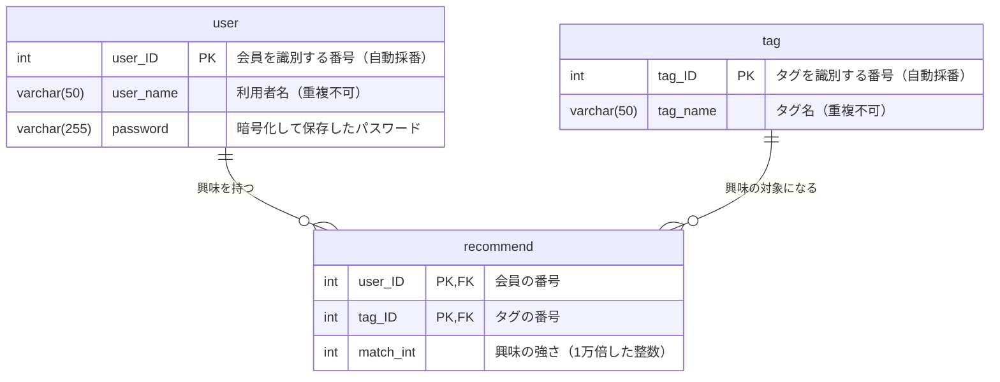

# データベース設計

## 1. 概要

MyTechPulseは、利用者ごとの「どの技術分野にどれくらい興味があるか」を数値で持ち、その数値をもとに記事を選んで届けるサービスである。そのためデータベースには次の3つを保存する。

- 会員の情報（利用者名とパスワード）
- 技術分野の名前（タグ）の一覧
- 「どの会員が、どのタグに、どれくらい興味を持っているか」の強さ

データベースはPostgreSQL 17を使い、Dockerコンテナ上で動かす。テーブルはプログラム側の定義（`backend/app/models/`）から自動で作られる（`backend/init_db.py`）。何度実行しても同じ結果になるため、既に作成済みのテーブルが壊れることはない。

## 2. テーブル一覧

| テーブル名 | 日本語名 | 役割 |
| --- | --- | --- |
| `user` | 会員 | 会員登録した利用者の名前とパスワードを保存する |
| `tag` | タグ | 「Python」「React」などの技術分野の名前を保存する |
| `recommend` | 興味の強さ | どの会員がどのタグにどれくらい興味を持っているかを保存する（会員とタグをつなぐ表） |

## 3. ER図

1人の会員は複数のタグに興味を持てて、1つのタグは複数の会員から興味を持たれる。この「多対多」の関係を表現するために、間に `recommend` を置いている。

## 4. テーブル定義

### 4.1 `user`（会員）

| 列名 | 型 | 必須 | キー | 説明 |
| --- | --- | --- | --- | --- |
| `user_ID` | INTEGER | ○ | 主キー | 会員を識別する番号。登録時に自動で採番される |
| `user_name` | VARCHAR(50) | ○ | 一意 | 利用者名。同じ名前での重複登録はできない |
| `password` | VARCHAR(255) | ○ | | パスワード。そのままの文字列ではなく、元に戻せない形に変換して保存する |

- パスワードは変換後の文字列が長くなるため、余裕を持って255文字分の領域を確保している
- 会員を削除すると、その会員の `recommend` の行もあわせて削除される

### 4.2 `tag`（タグ）

| 列名 | 型 | 必須 | キー | 説明 |
| --- | --- | --- | --- | --- |
| `tag_ID` | INTEGER | ○ | 主キー | タグを識別する番号。登録時に自動で採番される |
| `tag_name` | VARCHAR(50) | ○ | 一意 | タグ名。同じ名前のタグが二重に作られないようにしている |

- タグは会員登録時に選ばれた興味分野をもとに登録される。既に同じ名前のタグがあればそれを使い回し、無ければ新しく追加する
- タグを削除すると、そのタグに関する `recommend` の行もあわせて削除される

### 4.3 `recommend`（興味の強さ）

| 列名 | 型 | 必須 | キー | 説明 |
| --- | --- | --- | --- | --- |
| `user_ID` | INTEGER | ○ | 主キー・外部キー（`user.user_ID`） | どの会員かを示す |
| `tag_ID` | INTEGER | ○ | 主キー・外部キー（`tag.tag_ID`） | どのタグかを示す |
| `match_int` | INTEGER | ○ | | 興味の強さ |

- 主キーは `user_ID` と `tag_ID` の組み合わせ。同じ会員・同じタグの行が二重に作られることはない
- 参照先の会員またはタグが削除された場合、この表の該当行も自動で削除される（連鎖削除）

## 5. 興味の強さの持ち方

`match_int` は、このデータベース設計で最も注意が必要な箇所である。

- 本来の興味の強さは「0〜1の小数」で扱う（例: 0.4523）
- しかし小数のまま保存すると誤差が出るため、**1万倍した整数**に直して保存する（0.4523 → 4523）
- 読み出すときは1万で割って小数に戻す

この変換はサービス層（`backend/app/services/click_service.py`、`backend/app/services/news_service.py`）で行っている。変換を忘れると数値の桁が1万倍ずれてしまい、記事の並び順が壊れるため、この列を扱う処理を追加する場合は必ず変換をあわせて行う。

なお、会員登録の直後は仮の初期値として `1` を入れており（`backend/app/crud/recommend.py:9`）、その後の記事クリックによって値が更新されていく。

## 6. データの流れ

| 場面 | データベースへの操作 |
| --- | --- |
| 会員登録 | `user` に1行追加する。選ばれた興味分野を `tag` に登録（既存なら使い回し）し、`recommend` に会員とタグの組み合わせを追加する |
| ログイン | `user` を利用者名で検索し、保存されているパスワードと照合する |
| 記事一覧の表示 | `recommend` からその会員の興味の強さを読み出し、強い順に上位5件のタグで外部サイトから記事を取得して並べ替える |
| 記事のクリック | その会員の `recommend` の全行の値を少しずつ減らし、クリックされた記事のタグの値を増やして保存し直す |

記事そのものはデータベースに保存していない。表示のたびにQiita・Zennから取得しているため、記事用のテーブルは存在しない。

## 7. 今後の検討事項

- 記事を毎回外部サイトから取得しているため表示に時間がかかる。記事を1日1回まとめて取得して保存する方式に変える場合、記事を保存するテーブルの追加が必要になる
- 現状はテーブル定義の変更をプログラム側の定義の書き換えで行っている。運用開始後にデータを保持したまま列を追加・変更する場合は、変更履歴を管理する仕組み（マイグレーション）の導入を検討する
