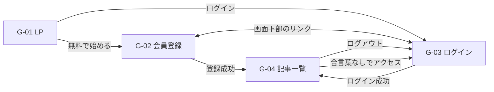

# 画面一覧

MyTechPulseの画面を一覧にしたもの。実際の実装は`frontend/index.html`（LP）と`frontend/src/pages/`（ログイン後のSPA）にあり、この文書はその内容を人が読める形に書き起こしている。

- 画面IDは要件定義書の画面一覧（[RequirementsSpecification.md](../../RequirementsSpecification.md)）のG-01〜G-04と対応する
- ステータスコードごとの文言（エラーメッセージ等）はこの資料の対象外。APIの資料側（`docs/BasicDesignSpecifications/API/`）でまとめて定義する予定
- この資料が扱うのは画面のレイアウト・表示項目・入力チェック・状態ごとの見え方・レスポンシブ対応など、見た目と振る舞いのルール

## 1. 資料の構成

画面の資料は役割ごとに次のように分けている。このファイルは入口にあたる。

| ファイル | 書かれていること |
| --- | --- |
| ScreenList.md（このファイル） | 画面の一覧と、各資料への案内 |
| [ScreenCommonRules.md](ScreenCommonRules.md) | すべての画面に共通する決まりごと（共通レイアウト・レスポンシブの方針・エラー表示の見た目・入力チェックの共通ルール） |
| [Details/LandingPage.md](Details/LandingPage.md) | サービス紹介ページの詳細 |
| [Details/SignUp.md](Details/SignUp.md) | 会員登録画面の詳細 |
| [Details/Login.md](Details/Login.md) | ログイン画面の詳細 |
| [Details/ArticleList.md](Details/ArticleList.md) | 記事一覧画面の詳細 |

## 2. 画面一覧

| 画面ID | 名前 | ログイン | 実装場所 | 対応する機能 | 詳細 |
| --- | --- | --- | --- | --- | --- |
| G-01 | サービス紹介ページ（LP） | 不要 | `frontend/index.html` | F-1-1, F-1-2 | [LandingPage.md](Details/LandingPage.md) |
| G-02 | 会員登録画面 | 不要 | `frontend/src/pages/SignupPage.tsx` | F-2-1〜F-2-3, F-2-9, F-3-1〜F-3-4 | [SignUp.md](Details/SignUp.md) |
| G-03 | ログイン画面 | 不要 | `frontend/src/pages/LoginPage.tsx` | F-2-4〜F-2-9 | [Login.md](Details/Login.md) |
| G-04 | 記事一覧画面 | 必要 | `frontend/src/pages/ArticlesPage.tsx` | F-4-1〜F-4-9, F-5-1〜F-5-4 | [ArticleList.md](Details/ArticleList.md) |

現在の画面は以上の4つのみ。

## 3. 画面遷移の概要

- G-01はReactを使わない静的ページで、G-02〜G-04は`/app/`配下のSPA（React）が担当する
- G-04は合言葉（JWT）を持っていない状態で開こうとすると、自動的にG-03へ戻される（[Login.md](Details/Login.md)を参照）

## 4. 補足

- 4画面とも共通のヘッダー・フッターを使う。ただしG-01だけは静的HTMLとして独立しており、SPA側の共通部品（`frontend/src/components/AppLayout.tsx`ほか）とは別実装になっている（理由は[ScreenCommonRules.md](ScreenCommonRules.md)を参照）
- 画面を増やすときは、このファイルの一覧に1行足したうえで、該当する詳細ファイルを`Details/`に追加する
