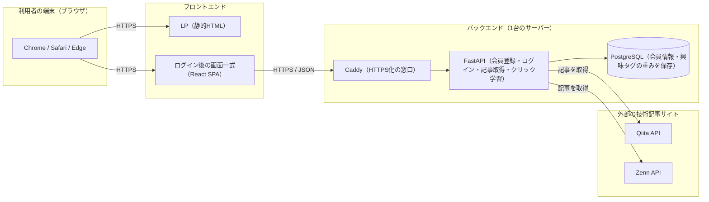

# システム構成図

## 1. 論理構成

MyTechPulseは、画面を表示する部分（フロントエンド）と、データのやり取りや記事の取得・スコア計算を行う部分（バックエンド）を分離した構成になっている。本番環境ではさらに、フロントエンドとバックエンドを別々のサービスに分けて動かす。

- 利用者はブラウザからLP（サービス紹介ページ）を開き、会員登録・ログインを行うと、記事一覧などログイン後の画面（SPA）に進む
- SPAはブラウザ上で動作し、ログイン情報や記事一覧などのデータをバックエンドAPIに問い合わせて画面に表示する
- バックエンドAPIは、利用者の興味タグの重みをもとにQiita・Zennから記事を取得し、スコアをつけてフロントエンドに返す
- 会員情報・パスワード（ハッシュ化済み）・興味タグの重みはPostgreSQLに保存する

## 2. 技術スタック

| 区分 | 採用技術 | 備考 |
| --- | --- | --- |
| フロントエンド | Vite + React + TypeScript | `frontend/`。LP（`frontend/index.html`）はReactを読み込まない静的HTML、ログイン後は`/app/`配下のSPA |
| バックエンド | FastAPI（Python） | `backend/app/`。routes → services → crud → modelsのレイヤード構成 |
| ORM | SQLAlchemy | `backend/app/models/` |
| データベース | PostgreSQL 17 | Dockerコンテナで起動 |
| 認証方式 | JWT（HS256） | ログイン成功時に`access_token`を発行し、`Authorization: Bearer`ヘッダーで本人確認する |
| パスワード保護 | ハッシュ化 | 生のパスワードは保存しない（`backend/app/utils/hashing.py`） |
| コンテナ化 | Docker / Docker Compose | `docker-compose.yml`でDB・API・（本番のみ）HTTPS終端をまとめて起動 |
| HTTPS終端 | Caddy | 本番のみ起動（`docker compose --profile prod`）。証明書の自動取得・更新を担う |

## 3. 外部連携

| 連携先 | 用途 | 補足 |
| --- | --- | --- |
| Qiita API | 興味タグに合う技術記事の取得 | `QIITA_ACCESS_TOKEN`を使って認証付きで取得する |
| Zenn API | 興味タグに合う技術記事の取得 | 認証トークンは不要 |

バックエンドは利用者の興味タグの重み上位5件をもとに、Qiita・Zennへ同時に問い合わせを行い（`backend/app/services/news_service.py`）、直近5日以内の記事に絞ったうえでスコアの高い順に並べ替えて返す。

## 4. 本番デプロイ構成

構成の決定経緯はIssue #65（フロントエンドとバックエンドを分ける判断）・Issue #67（デプロイ先の確定）にある。

| 区分 | 提供先 | 役割 |
| --- | --- | --- |
| フロントエンド | Cloudflare Pages | LP・SPAの静的ファイルを配信する |
| バックエンド＋DB | AWS Lightsail（東京リージョン、1GBプラン） | FastAPI・PostgreSQLをDocker Composeで1台にまとめて動かす |

- フロントエンドとバックエンドを別サービスに分けているため、ブラウザからバックエンドAPIへのアクセスはオリジンをまたぐ通信になる。バックエンド側でアクセスを許可するサイトを限定しており、許可されていないサイトからはAPIを呼び出せない
- サーバーは1台構成のため、そのサーバーが停止するとサービス全体が止まる（非機能要件のとおり、個人開発規模として許容している）
- 手順の詳細は`docs/deploy/lightsail-provisioning.md`を参照
