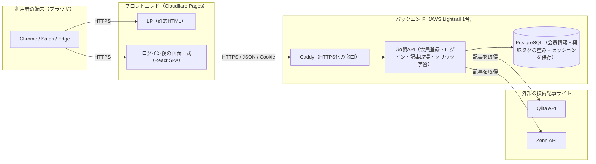
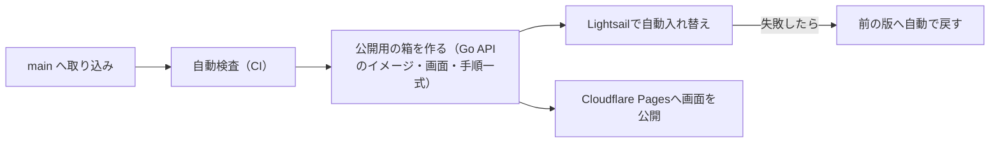

# システム構成図

## 1. 論理構成

MyTechPulseは、画面を表示する部分（フロントエンド）と、データのやり取りや記事の取得・点数計算を行う部分（バックエンド）を分離した構成になっている。本番環境では、フロントエンドとバックエンドを別々のサービスに分けて動かす。バックエンドはGoで作った1つのプログラム（モジュラーモノリス。理由は[ADR 0001](../adr/0001-use-go-modular-monolith.md)）で、中は機能ごとに分かれている。

```mermaid
flowchart LR
    subgraph client["利用者の端末（ブラウザ）"]
        Browser["Chrome / Safari / Edge"]
    end

    subgraph frontend["フロントエンド（Cloudflare Pages）"]
        LP["LP（静的HTML）"]
        SPA["ログイン後の画面一式（React SPA）"]
    end

    subgraph backend["バックエンド（AWS Lightsail 1台）"]
        Caddy["Caddy（HTTPS化の窓口）"]
        API["Go製API（会員登録・ログイン・記事取得・クリック学習）"]
        DB[("PostgreSQL（会員情報・興味タグの重み・セッションを保存）")]
    end

    subgraph external["外部の技術記事サイト"]
        Qiita["Qiita API"]
        Zenn["Zenn API"]
    end

    Browser -->|HTTPS| LP
    Browser -->|HTTPS| SPA
    SPA -->|HTTPS / JSON / Cookie| Caddy
    Caddy --> API
    API --> DB
    API -->|記事を取得| Qiita
    API -->|記事を取得| Zenn
```

- 利用者はブラウザからLP（サービス紹介ページ）を開き、会員登録・ログインを行うと、記事一覧などログイン後の画面（SPA）に進む
- SPAはブラウザ上で動作し、ログイン中かどうかや記事一覧などのデータをバックエンドAPIに問い合わせて画面に表示する
- バックエンドAPIは、利用者の興味タグの重みをもとにQiita・Zennから記事を取得し、点数をつけてフロントエンドに返す
- 会員情報・パスワード（ハッシュ化済み）・興味タグの重み・ログインのセッション（ハッシュ化済み）はPostgreSQLに保存する

### バックエンド内部の構成

バックエンドは、機能ごとに次のように分かれている（`server/internal/`）。

| 区分 | 場所 | 役割 |
| --- | --- | --- |
| 認証 | `auth/` | 会員登録、ログイン、セッションの作成・確認・失効、パスワードの照合 |
| 興味 | `interest/` | 興味の強さの計算（弱める・足す）と、タグの表記ゆれの扱い |
| 記事の推薦 | `recommendation/` | 上位タグの選択、記事の絞り込み・点数付け・並べ替え |
| 記事の取得 | `provider/`（`qiita/`・`zenn/`） | QiitaとZennからの取得。提供元ごとの違いはここで吸収する |
| 記事 | `article/` | 提供元に関係なく共通の記事の形と検査 |
| データベース | `store/` | データベースの読み書き（SQLから自動で作ったコードを使う） |
| 共通基盤 | `platform/` | 環境設定、HTTP共通処理（エラーの形、CORS、CSRF、ログ）、データベース接続 |
| 稼働確認 | `health/` | 生存確認とデータベース接続の確認 |
| 組み立て | `app/` | 上の部品をつなぎ、APIとして公開する |

依存の向きは、窓口（認証・推薦）→ 業務の処理 → データベースや外部サービスの順で、逆向きには呼ばない。

## 2. 技術スタック

| 区分 | 採用技術 | 備考 |
| --- | --- | --- |
| フロントエンド | Vite + React + TypeScript | `frontend/`。LP（`frontend/index.html`）はReactを読み込まない静的HTML、ログイン後は`/app/`配下のSPA |
| バックエンド | Go（標準のHTTPサーバー + huma） | `server/`。APIの仕様（OpenAPI）をコードから自動で書き出す |
| データベースの操作 | sqlc + pgx | SQLを書き、型付きのコードを自動生成する（`server/internal/store/dbgen/`） |
| 変更履歴の管理 | goose（マイグレーション） | `server/db/migrations/`。本番へは「追加するだけ」の変更に限る（自動検査あり） |
| データベース | PostgreSQL 17 | Dockerコンテナで起動 |
| 認証方式 | サーバー側セッション | ログイン成功時に乱数の合言葉をCookie（HttpOnly）で渡し、データベースにはそのハッシュを保存する（[ADR 0002](../adr/0002-use-server-side-sessions.md)） |
| パスワード保護 | bcrypt | 生のパスワードは保存しない |
| エラーの形 | Problem Details（RFC 9457） | 失敗はHTTPステータスと共通の形で返す |
| コンテナ化 | Docker / Docker Compose | `docker-compose.yml`でDB・API・（本番のみ）HTTPS終端をまとめて起動 |
| HTTPS終端 | Caddy | 本番のみ起動（`docker compose --profile prod`）。証明書の自動取得・更新を担う |
| 自動検査と公開 | GitHub Actions | `.github/workflows/`。検査、イメージの作成、本番への反映を自動で行う |

## 3. 外部連携

| 連携先 | 用途 | 補足 |
| --- | --- | --- |
| Qiita API | 興味タグに合う技術記事の取得 | `QIITA_ACCESS_TOKEN`を使って認証付きで取得する |
| Zenn API | 興味タグに合う技術記事の取得 | 認証トークンは不要。公式仕様が無いため、応答の形の変化を検出する |

バックエンドは利用者の興味タグの重み上位5件をもとに、Qiita・Zennへ同時に問い合わせを行い、Qiitaは直近5日、Zennは直近14日の記事に絞ったうえで点数の高い順に並べ替えて返す。詳細は[API詳細（おすすめ記事の取得）](API/Details/News.md)と[外部サービスへの問い合わせ](API/ApiExternal.md)を参照。

## 4. 本番デプロイ構成

構成の決定経緯は[ADR 0003](../adr/0003-host-on-cloudflare-pages-and-lightsail.md)にある。

| 区分 | 提供先 | 役割 |
| --- | --- | --- |
| フロントエンド | Cloudflare Pages | LP・SPAの静的ファイルを配信する |
| バックエンド＋DB | AWS Lightsail（東京リージョン、1GBプラン） | Go製API・PostgreSQL・CaddyをDocker Composeで1台にまとめて動かす |

- フロントエンドとバックエンドを別サービスに分けているため、ブラウザからバックエンドAPIへのアクセスはオリジンをまたぐ通信になる。バックエンド側でアクセスを許可するサイトを限定し、書き込み操作には専用ヘッダーも必須にしている（[APIの共通の決まりごと](API/ApiCommonRules.md#4-他のサイトからの悪用を防ぐ決まりcorsとcsrf)）
- 本番のCookie名は`__Host-mtp_session`で、`Secure`が付く。開発中は`mtp_session`で、`Secure`は付かない
- 本番では、自動生成の説明ページ（`/docs`）を閉じる。開いたままでは起動しない
- サーバーは1台構成のため、そのサーバーが停止するとサービス全体が止まる（非機能要件のとおり、個人開発規模として許容している）

### 公開の流れ

`main`への取り込みをきっかけに、GitHub Actionsが自動で本番へ反映する。

```mermaid
flowchart LR
    M["main へ取り込み"] --> CI["自動検査（CI）"]
    CI --> R["公開用の箱を作る（Go APIのイメージ・画面・手順一式）"]
    R --> D["Lightsailで自動入れ替え"]
    R --> P["Cloudflare Pagesへ画面を公開"]
    D -->|失敗したら| B["前の版へ自動で戻す"]
```

- 公開用の箱は、中身が変わっていないことを確かめられる印（ダイジェスト）付きで作り、その印のものだけを入れ替える
- データベースの変更は「追加するだけ」の変更に限る。そのため、API入れ替えに失敗して前の版へ戻っても、データベースは巻き戻さずに済む
- 入れ替えの前に、データのコピー（バックアップ）を取る
- 手順の詳細は[go-auto-deploy.md](../deploy/go-auto-deploy.md)、サーバーの用意は[lightsail-provisioning.md](../deploy/lightsail-provisioning.md)、バックアップは[database-backup-and-restore.md](../deploy/database-backup-and-restore.md)を参照
