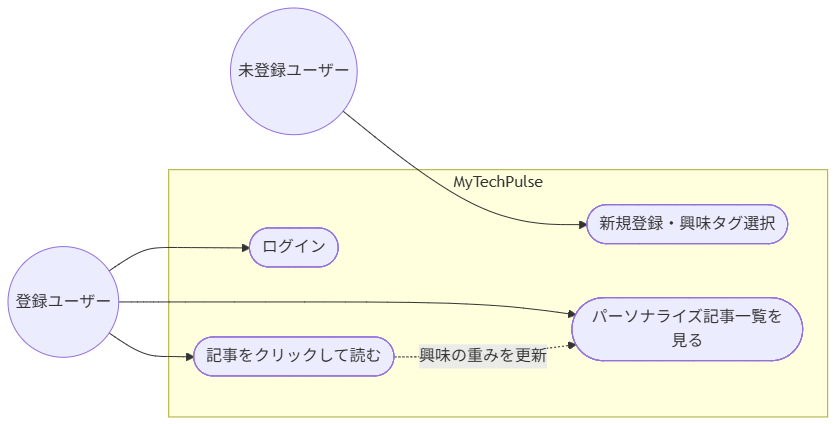
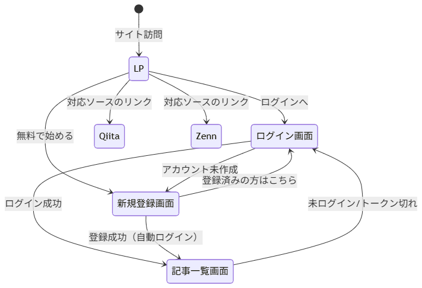

# 要件定義書

* **プロジェクト名:** MyTechPulse
* **作成日:** 2025年9月20日
* **作成者:** K.Haruki , はりぃ！
* **バージョン:** 1.0

---

## 1. プロジェクト概要

### 1.1 背景・現状の課題

* 技術のキャッチアップが大事だと言われているが、どうやってキャッチアップすればいいのかわからない。
* キャッチアップをしようにも、公式サイトやドキュメント、Qiita, Zenn, Xなど、複数のサイトを横断しなければならないのが手間。

### 1.2 目標

* 技術キャッチアップをもっと楽にする。
* 通勤時間、隙間時間にサクッとキャッチアップできるようにする。
* このプロダクト1つでキャッチアップを完結できるようにする。

### 1.3 利用対象者（ユーザー定義）

* **エンドユーザー:** ITエンジニア、ITに興味のある人
* **システム管理者:** K.Haruki, はりぃ！

---

## 2. ユースケース

### 2.1 ユースケース図

---

## 3. 機能要件

### 3.1 実装機能

* **実装済み:**
    * ユーザー登録／ログイン（JWT認証）
    * 興味タグの選択
    * Qiita・Zennからのパーソナライズ記事取得
    * 記事クリックによる興味学習（重み更新）

* **未実装:**
    * ブックマーク機能
    * アンケートフォーム
    * 

### 3.2 画面一覧・画面遷移

* **画面一覧:**
    * G-01: LP
    * G-02: 会員登録画面
    * G-03: ログイン画面
    * G-04: 記事一覧画面

* **画面遷移:**

---

## 4. 非機能要件

| 項目 | 要件仕様 |
| --- | --- |
| **性能・キャパシティ** | 記事一覧が表示されるまでの待ち時間は5秒以内を目安とする（外部サイトから記事を取ってくる処理が入るため） / 個人開発規模を想定しており、同時に使う人数は数十人程度まで。大人数が一気にアクセスした場合の対策は今のところ考えていない |
| **可用性・稼働率** | 「絶対に落ちない」ことは目指さず、個人運営としてできる範囲で運用する / サーバーは1台だけで動かしており、そのサーバーが止まるとサービス全体が止まる |
| **セキュリティ** | 通信内容はすべてHTTPS(TLS)で暗号化して送る / パスワードは元の文字列に戻せない形に変換（ハッシュ化）してから保存しており、生のパスワードはどこにも残らない / ログインすると期限付きの合言葉(JWT)が発行され、それを使って本人確認を行う。この合言葉には有効期限(トークン)があり、期限が切れると使えなくなる / サーバー側で合言葉を強制的に無効化する仕組みはまだなく、ログアウトは手元の端末から合言葉を消すだけの対応になっている / 許可した特定のサイトからしかアクセスできないように制限している / ログイン失敗時に「その人が登録されていないのか」「パスワードが違うのか」を区別せず同じ表示にすることで、登録者を推測されないようにしている |
| **対応環境** | Chrome、Safari、Edgeなどの主要ブラウザの最新版で利用できることを想定している。パソコンでの利用を主に想定しており、専用のスマホアプリはない |
| **データ保持・バックアップ** | 毎日自動でデータのコピー（バックアップ）を取り、圧縮して保存している / 保存しておく期間は7日間で、それより古いものは自動的に消える / バックアップからデータを元に戻す手順は、まだきちんと確認・整備できていない |

