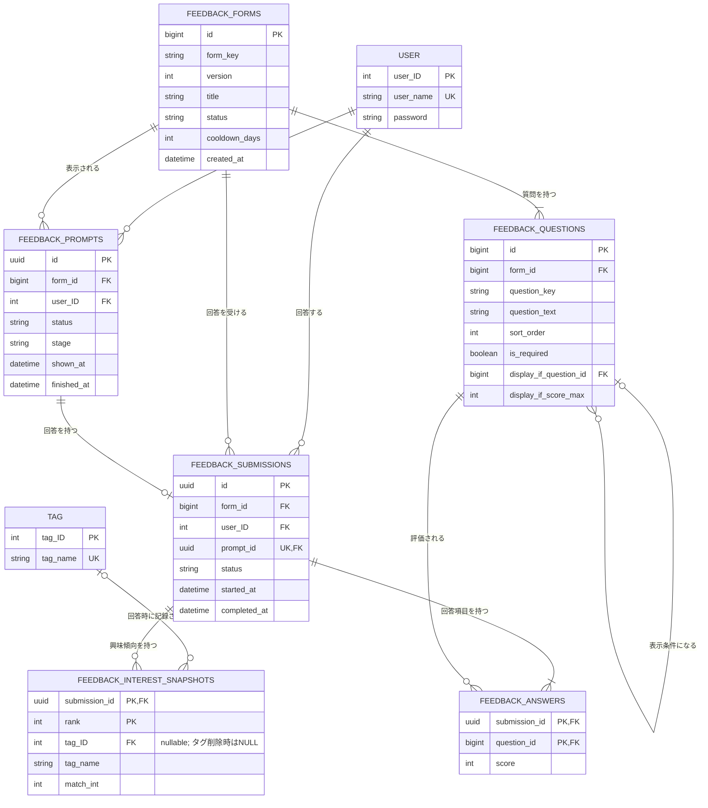
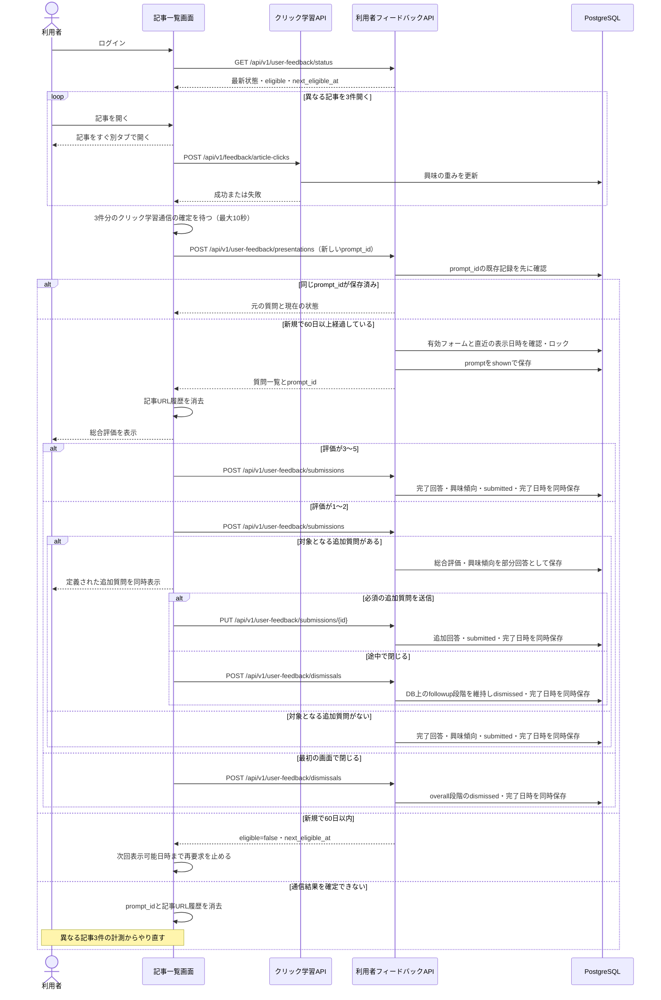

# 利用者フィードバック機能 設計

- 関連Issue: [#84 feat: アンケート機能の実装](https://github.com/H4aruki/MyTechPulse/issues/84)
- 設計確定日: 2026-09-10
- 改訂日: 2026-10-09（Go版バックエンドへの合わせ込み。第0章を参照）
- 対象: MyTechPulseの記事一覧を利用するログイン済み利用者

## 0. 2026-10-09 改訂の要点

初版は旧Python版（FastAPI、JWT、`init_db.py`）を前提に書いた。その後、本番はGo版へ切り替わった（2026-10-07）ため、次の点を改めた。画面の動き、質問内容、表示条件、データの意味は初版から変えていない。

| 項目 | 初版 | 改訂後 |
| --- | --- | --- |
| 本人確認 | JWTから利用者を特定 | 認証セッション（Cookie）から利用者を特定（ADR 0002） |
| APIの場所 | `/feedback/...` | `/api/v1/user-feedback/...`。既存の `/api/v1/feedback/article-clicks`（クリックフィードバック）と区別するため、`user-feedback` とする |
| 更新系の要求 | 規定なし | 既存のCSRF対策（許可されたOriginと `X-MTP-CSRF` ヘッダー）の対象。エラーはProblem Details（RFC 9457） |
| API契約 | 規定なし | `server/openapi/openapi.json` を生成し直し、`frontend/src/api/` の型と呼び出しを同時に更新する |
| クリック学習の窓口 | `POST /article/click` | `POST /api/v1/feedback/article-clicks` |
| 質問の登録 | JSONを `init_db.py` の後に取り込み、起動時に同期 | DBの移行ファイル（goose）に質問を直接書く。JSON取り込みと起動時同期は作らない（第12章） |
| 2年超のデータ削除 | 日次の保守処理 | アプリが表示判定の処理のついでに削除する。既存の期限切れセッション削除と同じ考え方（第14章） |
| プライバシーポリシーへの記載 | 完成条件に含める | ポップアップ内の説明で先に公開してよい（オーナー判断 2026-10-09）。ポリシーへの記載は #185 で行う |
| クリック学習の待ち時間 | 「通常の通信タイムアウト」 | フロントエンドの通信には時間切れの設定がないため、待つ上限を10秒と定める（第8章） |

## 1. 目的

記事を閲覧した利用者から、サービス全体への評価と、低評価になった原因を短時間で収集する。回答率を下げないことを優先し、最初は1問だけを表示する。低評価の場合に限り、原因を特定する追加質問を表示する。初期版の追加質問は3問とする。

回答と表示・離脱の履歴は利用者に紐づけ、評価の変化や利用者の興味傾向と合わせて分析できるようにする。

## 2. 対象範囲

### 含めるもの

- 記事一覧上のフィードバック用ポップアップ
- 5段階の総合評価
- 低評価時に表示する追加評価（初期版は3問）
- DBの移行ファイルによる質問の登録
- 質問セットの版管理と有効状態の管理
- 回答途中・完了状態の保存
- 表示、閉じる、回答完了を表すプロンプト状態
- 回答時点の上位5件の興味タグと重み
- 利用者ごとの60日間の再表示制限
- 2年間のデータ保持と、期限を過ぎたデータの削除

### 含めないもの

- 質問を編集する管理画面
- 回答を閲覧・分析する管理画面
- CSVなどへの出力
- 自由記述
- 記事ごとの評価ボタン
- 質問形式の追加（初期版は5段階評価のみ）
- プライバシーポリシーへの記載（#185 で扱う）

## 3. 用語

用語の正本は `CONTEXT.md` とする。

- **利用者フィードバック**: MyTechPulseの使い勝手や改善点に関する回答。回答時の利用者に紐づく。記事クリックによる学習（クリックフィードバック）とは別のもの。
- **フィードバックフォーム**: 同時に利用する質問と表示条件をまとめたもの。同じフォームの内容を変える場合は新しい版を作る。
- **プロンプト**: 1回のポップアップ表示から、閉じるまたは回答完了までの一連の操作。
- **部分回答**: 総合評価は保存済みだが、低評価時の必須追加質問が完了していない回答。
- **興味傾向スナップショット**: 総合評価へ回答した時点の、興味度が高い技術タグとその値の記録。

## 4. 調査から採用した方針

大規模サービスの公開情報では、最初の回答を少ない操作で完了できるようにし、必要な場合だけ詳しい質問へ進める方法が使われている。

- Netflixは3種類の評価で、コンテンツへの反応を1操作で受け付けている。
- YouTubeは選択式の満足度質問をサービス内に表示している。
- Airbnbは項目別評価を先に集め、低評価の場合に理由を追加で尋ねている。
- AppleとGoogleは、利用者が主要な操作を経験した後に依頼し、頻繁に表示しないことを推奨している。

MyTechPulseでは、1問の総合評価を入口にし、評価が1または2の場合だけ追加質問を表示する。質問数は定義に従って変えられるようにする。

## 5. 質問内容

すべて5段階評価とする。値は1が最低、5が最高を表す。

### 最初に表示する質問

**今日のおすすめ記事は役に立ちましたか？**

- 1〜2: 対象となる追加質問があれば回答を部分回答として保存して追加質問へ進む。なければ完了状態として終了する
- 3〜5: 回答を完了状態として保存し、終了する

### 低評価時の追加質問

初期版では次の3問を同じ画面にまとめて表示する。

1. おすすめ記事は、あなたの興味に合っていましたか？
2. おすすめ記事の新しさに満足しましたか？
3. 記事一覧画面は使いやすかったですか？

表示された必須質問をすべて選択したときだけ送信できる。自由記述欄は設けない。

## 6. 表示条件

次の条件をすべて満たす場合に表示する。

1. ログイン済みで記事一覧を利用している
2. 同じブラウザで異なる記事を3件以上開いている
3. 同じ利用者にフィードバックを表示してから60日以上経過している、または一度も表示していない
4. 有効なフィードバックフォームが存在する

記事のURLは現在のログイン中だけ`sessionStorage`へ保存し、利用者IDや利用者名を保存キーに含めない。ログイン成功時、ログアウト時、認証切れ（401）で記事一覧を離れる時に、記事URL履歴、表示要求中の`prompt_id`、次回表示可能日時をすべて消去する。記事URLはフィードバックAPIへ送信せず、サーバー側の60日判定を最終判断とする。

異なる記事3件という条件は初期版の固定仕様とし、質問定義やDBでは管理しない。件数を変更する場合は、フロントエンドの仕様変更として扱う。

表示APIが`status = shown`として質問の表示を許可する応答を返した時点で、記事URL履歴を消去する。`eligible = false`の場合は履歴を維持し、応答の`next_eligible_at`まで表示APIを呼ばない。表示APIの通信結果を確定できなかった場合は、要求中の`prompt_id`と記事URL履歴を消去し、異なる記事3件の計測からやり直す。前回の要求が実際にはサーバーへ届いていた場合も、次の表示要求でサーバーが直近の`shown_at`を確認するため、重複表示は発生しない。

ポップアップを表示した時点で60日間の非表示期間を開始する。回答せずページを移動した場合も、短期間に再表示しない。

## 7. 画面動作

### 総合評価

- 5つの選択肢を一度に表示する。
- 閉じるボタンとEscキーで回答せず閉じられる。
- 3〜5を選んだ場合はその回答を保存し、お礼を表示して終了する。
- 1〜2を選んだ場合は総合評価をすぐ保存し、対象となる追加質問があれば追加質問の画面へ進む。追加質問がなければ完了として終了する。
- 回答を利用者に紐づけて保存することと、サービス改善の分析に使うことを、ポップアップ内に短く表示する。

### 追加質問

- 定義された追加質問を同じ画面にまとめて表示する。初期版は3問とする。
- 表示された必須質問の選択が終わるまで送信ボタンを無効にする。
- 送信に成功したら部分回答を完了状態へ更新し、お礼を表示する。
- 途中で閉じた場合、総合評価は残し、追加質問の入力途中の値は保存しない。
- 途中で閉じた操作は、追加質問段階での離脱として記録する。

### 通信エラー

- 表示判定に失敗した場合はポップアップを表示せず、要求中の`prompt_id`と記事URL履歴を消去する。次の表示要求には、異なる記事3件を改めて開く必要がある。
- 総合評価の保存に失敗した場合は追加質問へ進まず、再送信できるようにする。
- 追加質問の保存に失敗した場合は選択内容を画面に残し、再送信できるようにする。
- 利用者がエラー画面を閉じた場合は離脱として記録を試みる。通信できない場合は記事閲覧を優先する。
- 401（認証切れ）を受けた場合は、既存の記事一覧と同じくログイン画面へ戻し、未送信の回答内容は破棄する。
- ログインまたはログアウトによって画面を離れた場合、未送信の回答内容は破棄する。次回ログイン時はサーバーへ最新状態を問い合わせ、処理済みの回答やプロンプトを重複登録しない。

### アクセシビリティ

- ポップアップを開いたときは、操作位置をポップアップ内へ移す。
- Tabキーの移動範囲をポップアップ内に限定する。
- Escキーで閉じられるようにする。
- 5段階評価はキーボードでも選べるようにし、数値だけでなく意味の分かるラベルを付ける。
- スマートフォン幅でも追加質問と送信操作が画面外へ欠けないようにする。

## 8. システム構成

- フロントエンドは記事クリック数と次回表示可能日時を現在の認証セッション内で管理し、ログイン・ログアウト・認証切れの時に消去する。
- フロントエンドはフィードバック表示前に、表示条件に数えた記事のクリック学習通信（`POST /api/v1/feedback/article-clicks`）がすべて成功または失敗で確定するまで待つ。記事を開く操作自体は待たせない。
- 既存の通信処理には時間切れの設定がないため、クリック学習通信の確定を待つのは最大10秒とする。10秒を過ぎた通信は確定したものとして扱い、表示処理を続ける。失敗も確定として扱う。サーバーに保存済みの最新の重みを回答時点の値として使う。
- バックエンドは、機能ごとのパッケージ構成（ADR 0001）に合わせて `server/internal/userfeedback/` を新設する。表示可否、質問定義、回答、プロンプト状態、興味傾向スナップショットの正しい状態を管理する。
- APIの登録は既存と同じくhumaを使い、保護APIとして認証セッションのCookieを要求する。
- DB問い合わせは `server/db/queries/` に追加し、`go tool sqlc generate` で `server/internal/store/dbgen/` へ生成する。複数のテーブルを同時に更新する処理（第10章で「同じDB処理」と書いたもの）は、`server/internal/store/` 側で1つのトランザクションにまとめ、生成した問い合わせをその中で呼ぶ。
- PostgreSQLは質問定義、回答、プロンプト状態、興味傾向スナップショットを保存する。
- 質問定義はDBの移行ファイルで登録する（第12章）。
- 将来の管理画面は、移行ファイルと同じテーブルを同じ規則で更新する。画面向けAPIと回答APIの形式は維持する。

## 9. データモデル

既存のテーブル名・列名（`"user"."user_ID"`、`tag."tag_ID"`、`tag.tag_name`、`recommend.match_int`）に合わせる。新しいテーブルはすべて新規作成とし、既存テーブルは変更しない（DB変更は追加だけ、という規則に従う）。

日時は `timestamptz` とする。

### 9.1 `feedback_forms`

- `form_key`と`version`の組み合わせを重複不可にする。
- `status`は`draft`、`active`、`retired`のいずれかに限定する。
- 同時に`active`にできるフォームは1つだけとする（`status = 'active'`に限った部分一意索引）。
- 一度`active`にした版の質問内容は変更しない。変更時は新しい版を登録する。

### 9.2 `feedback_questions`

- 同じフォーム内で`question_key`を重複不可にし、`sort_order`も別の一意制約で重複不可にする。
- 表示条件を持たない質問は総合評価の1問だけとする。
- 追加質問は0問以上とし、すべて同じフォームの総合評価を`display_if_question_id`で参照し、`display_if_score_max = 2`を必須にする。追加質問から別の追加質問を参照する入れ子や循環参照は認めない。
- 初期版の追加3問は、総合評価の質問IDと`display_if_score_max = 2`を持つ。
- `display_if_question_id`が空なら`display_if_score_max`も空、`display_if_question_id`があれば`display_if_score_max = 2`となるDB制約を設ける。
- 初期版の評価値は1〜5に限定する。

### 9.3 `feedback_submissions`

- `user_ID`は認証セッションから特定し、リクエスト本文では受け取らない。
- `status`は`partial`または`completed`に限定する。
- 総合評価が1〜2で対象となる追加質問がある場合は`partial`として作成する。対象となる追加質問がなければ`completed`として作成する。
- 表示された必須追加質問の保存が成功した時点で`completed`へ更新する。
- 総合評価が3〜5の場合は最初から`completed`として作成する。
- `prompt_id`は重複不可とし、同じ表示から回答が複数作られないようにする。
- `partial`では`completed_at`を空、`completed`では`completed_at`を必須とするDB制約を設け、状態と日時を同じDB処理で更新する。

### 9.4 `feedback_answers`

- `submission_id`と`question_id`を複合主キーにする。
- `score`は1〜5に限定する。
- 質問が回答と同じフォームに属することをバックエンドで検証する。
- 部分回答では総合評価だけを保存する。

### 9.5 `feedback_prompts`

- `id`はフロントエンドが生成する`prompt_id`（UUID）とし、主キーによって通信の再送を重複登録しない。
- `status`は`shown`、`dismissed`、`submitted`に限定する。
- `stage`は`overall`または`followup`に限定する。
- 作成時は`status = shown`、`stage = overall`とする。
- 総合評価1〜2の保存後、対象となる追加質問がある場合だけ`stage = followup`へ更新する。
- `shown`から`dismissed`または`submitted`への変更だけを認め、最終状態同士の変更は認めない。
- 同じ最終状態への再送は既存結果を返し、別の最終状態への変更は競合（409）として拒否する。
- 状態更新時はプロンプト行をロックし（`SELECT ... FOR UPDATE`）、閉じる通信と回答完了通信が競合した場合は先に確定した最終状態だけを採用する。
- `shown_at`は表示記録の作成日時、`finished_at`は閉じるか回答を完了した日時とする。
- `shown`では`finished_at`を空、`dismissed`または`submitted`では`finished_at`を必須とするDB制約を設ける。最終状態への変更と`finished_at`の設定は同じDB処理で行う。

### 9.6 `feedback_interest_snapshots`

- 最初の総合評価を保存する時点で、表示条件に数えた記事のクリック学習通信がすべて確定した後の`recommend.match_int`を、高い順に最大5件保存する。
- `match_int`は変換せず、回答時点の整数値（興味度の10000倍）を保存する。
- 同じ重みの場合は`tag_ID`の昇順で順位を決める。
- タグ名が後から変更されても分析時の意味を保てるよう、`tag_ID`に加えて回答時点の`tag_name`も保存する。
- タグが削除された場合は`tag_ID`を空にし、保存済みの`tag_name`と`match_int`は維持する。
- 興味傾向は最初の回答時に一度だけ保存し、追加質問の完了時には更新しない。

### 9.7 利用者との関係

- 1人の利用者は、同じ`form_key`のフィードバックへ質問版をまたいで60日ごとに複数回答できる。
- `user_ID`自体には一意制約を付けない。
- 利用者を削除する場合は、その利用者のプロンプト、回答、回答項目、興味傾向スナップショットも削除する（`"user"("user_ID")`への外部キーを`ON DELETE CASCADE`にする）。

## 10. API設計

すべて `/api/v1/user-feedback/` 配下の保護APIとし、認証セッションのCookieを必須にする。利用者は認証セッションから特定し、利用者IDをリクエストへ含めない。POSTとPUTには既存のCSRF対策（許可されたOriginと`X-MTP-CSRF`ヘッダー）が適用される。エラーはProblem Detailsで返す。

| 状況 | HTTPステータス |
| --- | --- |
| 未ログイン・認証切れ | 401 |
| 他の利用者の`prompt_id`・`submission_id` | 404（存在を区別させない） |
| 入力検証の失敗（不正な質問、未回答、範囲外の値） | 422 |
| 最終状態どうしの変更、状態に合わない操作 | 409 |
| 想定外の失敗 | 500 |

### `GET /api/v1/user-feedback/status`

ログイン成功後と記事一覧の表示時に呼び出し、前回の通信がサーバーで処理されたかと、現在の表示可否を確認する。

- 有効なフォームの`form_key`について、質問版をまたいだ直近のプロンプト状態、関連する回答状態、`eligible`、`next_eligible_at`を返す。質問や`prompt_id`は返さず、このAPIだけではポップアップを再表示しない。
- 前回の表示要求や回答がサーバーへ届いていれば、その保存済み状態を返す。届いていなければ、以前の状態または記録なしを返す。
- 直近のプロンプトが存在する場合は、その状態と`shown_at`を基準に60日ルールを維持する。記録がなく`eligible = true`の場合は、記事URL履歴を空の状態から開始し、異なる記事3件を開いた後に表示APIを呼ぶ。
- 有効なフォームがない場合は`eligible = false`、`next_eligible_at`は空で返す。
- フロントエンドは`next_eligible_at`を現在の認証セッションのメモリへ保持し、その日時より前は表示APIを呼ばない。ページ再読み込みでメモリが失われた場合は、このAPIを再度呼ぶ。
- 状態照会に失敗しても記事閲覧を妨げない。異なる記事3件を開いた後の表示APIでも同じ判定を行うため、状態照会の成功は表示APIを呼ぶための必須条件にしない。

### `POST /api/v1/user-feedback/presentations`

記事3件の条件を満たしたフロントエンドが呼び出す。本文は`prompt_id`だけを受け取る。

バックエンドは次を行う。

1. 認証セッションから利用者を特定する。
2. `prompt_id`が保存済みか確認する。保存済みならプロンプト行をロックし、利用者が一致することを検証して、そのプロンプトが参照する元のフォーム、質問、現在状態を返す。以降の新規表示判定は行わない。別の利用者のIDなら404を返す。
3. 保存済みでなければ、有効なフォームを取得する。
4. 利用者と`form_key`から作る安定したキーで、PostgreSQLのトランザクション単位のアドバイザリーロック（`pg_advisory_xact_lock`）を取得する。
5. ロック待機中に同じIDが保存される場合に備え、`prompt_id`を再確認する。保存済みならそのプロンプト行もロックし、手順2と同じ結果を返す。
6. 現在の版に限らず同じ`form_key`を持つ全版から直近の`shown_at`を調べ、60日以上経過しているか再確認する。
7. 表示できる場合は、フロントエンドが発行した`prompt_id`で`feedback_prompts`を`shown`として保存する。
8. 質問一覧、条件、`prompt_id`を返す。
9. 応答とは別に、期限を過ぎたデータの削除を試みる（第14章）。

フロントエンドは表示APIを呼ぶ直前に新しい`prompt_id`を生成し、要求が完了するまでメモリ上だけで保持する。同じHTTP要求を再送する場合は同じ値を使うが、結果を確定できなければその値を破棄し、記事URL履歴も消去する。次に異なる記事を3件開いた後は、新しい`prompt_id`で表示APIを呼ぶ。回答と離脱には、表示許可の応答を受けて画面状態へ保持した`prompt_id`を使う。

保存済みの`prompt_id`が`shown`なら、質問版が切り替わっていても元のフォームの同じ質問を返す。すでに`dismissed`または`submitted`なら現在の最終状態だけを返し、プロンプトを再表示しない。

新規表示ができない場合は、`eligible = false`と`next_eligible_at`を返す。フロントエンドは次回表示可能日時を現在の認証セッションのメモリへ保存し、その日時より前は記事を追加で開いても表示APIを呼ばない。日時を過ぎ、記事URL履歴が3件以上なら、記事一覧の表示時または次の記事を開いた時に再判定する。表示判定と`shown`の保存は同じDB処理内で行う。アドバイザリーロックにより、まだプロンプト行が存在しない初回表示でも、質問版の切り替えや複数タブによる連続表示を防ぐ。

`status = shown`として質問の表示を許可する応答を受け取ったフロントエンドは、記事URL履歴を消去する。`eligible = false`または最終状態だけが返った場合は履歴を維持する。通信結果を確定できなかった場合は履歴を消去し、3件の計測からやり直す。

### `POST /api/v1/user-feedback/submissions`

総合評価を保存する。本文は`prompt_id`と総合評価の`question_id`・`score`を受け取る。

- 3〜5の場合: 回答を`completed`で保存し、プロンプトを`submitted`へ更新する。
- 1〜2で対象となる追加質問がある場合: 回答を`partial`で保存し、プロンプトの段階を`followup`へ更新して、追加質問用の`submission_id`を返す。
- 1〜2で対象となる追加質問がない場合: 回答を`completed`で保存し、プロンプトを`submitted`へ更新する。
- いずれの場合も、同じDB処理内で回答時点の上位5件の興味タグと重みを保存する。

`completed`で保存する場合は回答の`completed_at`とプロンプトの`finished_at`も同じDB処理で設定する。`partial`で保存する場合は両方を空のままにする。

追加質問の有無、質問ID、必須状態、評価値の検証には、現在の有効版ではなく、対象の`feedback_prompts.form_id`が参照する表示時の質問版を使う。リクエストから`form_id`は受け取らない。

同じ`prompt_id`が再送された場合は既存の結果を返し、回答を重複登録しない。

### `PUT /api/v1/user-feedback/submissions/{submission_id}`

部分回答へ追加質問を保存する。表示された必須質問の保存、`completed`と`completed_at`への更新、プロンプトの`submitted`と`finished_at`への更新を同じDB処理内で行う。質問数と入力検証は、回答に結び付く`feedback_prompts.form_id`の質問版から判断し、現在の有効版や3問へ固定しない。

同じ完了通信が再送された場合は既存結果を返し、回答を重複登録しない。

### `POST /api/v1/user-feedback/dismissals`

回答せず閉じたことを保存する。リクエスト本文では`prompt_id`だけを受け取り、プロンプト行をロックして、DBに保存済みの`stage`を維持したまま`dismissed`と`finished_at`を同じDB処理で更新する。閉じた段階はクライアントから受け取らない。部分回答がある場合も総合評価と興味傾向スナップショットは維持する。

### 共通する入力検証

- 認証セッションが有効であること
- `prompt_id`がログイン利用者のものであること
- 回答・追加質問の判定と入力検証には`feedback_prompts.form_id`が示す表示時の質問版を使い、現在の有効版は新しいプロンプトの作成時だけ使うこと
- 質問が`feedback_prompts.form_id`のフォームに属すること
- 表示条件に合う質問だけが送られていること
- 必須回答がすべて含まれること
- 評価値が1〜5であること
- 完了または離脱済みのプロンプトを別の最終状態へ変更しようとしていないこと

### 契約の更新

- 新しいAPIを追加したら `cd server && go run ./cmd/openapi` で `server/openapi/openapi.json` を生成し直す。
- `frontend/src/api/` の生成型・呼び出し関数を同時に更新する（CIが差分を検査する）。

## 11. データの流れ

## 12. 質問定義の管理

質問定義は `server/db/migrations/` の移行ファイル（goose）に直接書いて登録する。JSONの取り込みや、アプリ起動時の同期処理は作らない。

- テーブルを作る移行ファイルと、初期版の質問（`form_key = 'service_satisfaction'`、版1、`active`、再表示間隔60日、総合評価1問と追加3問）を登録する移行ファイルを分ける。
- 質問内容を変える場合は、1つの移行ファイルの中で、先に以前の`active`版を`retired`へ移し、その後に新しい版のフォーム（`active`）と質問を`INSERT`する。`active`を1件に限る一意索引があるため、この順序を守る。gooseは1つの移行ファイルを1つのトランザクションで実行するため、途中で失敗すると全体が戻り、利用者から有効版がない状態は見えない。
- 過去のフォームと質問は、回答の意味を保持するため削除も書き換えもしない。既存の移行ファイルも書き換えない。
- 記事件数の条件は質問定義に含めない。
- 定義の正しさは、DB制約と、Goの定義検証処理で分担して守る。
  - DB制約で守るもの: 1行の中で決まる条件（状態の値、評価値の範囲、`display_if_question_id`と`display_if_score_max`の組み合わせ）、同じフォーム内での一意性、`active`が1件以下であること、同じフォーム内の質問への参照（`(form_id, id)`への複合外部キー）。
  - DB制約だけでは守れないもの: 複数の行にまたがる条件（総合評価がちょうど1問、追加質問がその総合評価だけを参照する）。これは `server/internal/userfeedback/` の定義検証処理で確かめる。トリガーによるDB側の強制は、書き込み経路が移行ファイルだけの間は作らない。
  - 定義検証処理は、移行後のDBに対する試験で必ず実行する。将来の管理画面など、移行ファイル以外の書き込み経路を作る場合は、保存前に同じ定義検証処理を通すことを必須とする。
- 移行後のDBに対する試験では次を検証する。
  - `active`のフォームがちょうど1つあること
  - そのフォームに、表示条件のない総合評価がちょうど1問あること
  - 追加質問はすべて同じフォームの総合評価を参照し、`display_if_score_max = 2`であること（別フォーム参照、追加質問への参照、自己参照を拒否する）
  - `question_key`と`sort_order`が、それぞれ同じフォーム内で重複していないこと
- 自動デプロイが失敗して直前の版へ戻った場合もDBは巻き戻らない。古い版のAPIは新しいテーブルを使わないだけなので、追加した質問が残っても問題にならない。

将来の管理画面は同じ規則でDBを更新する。

## 13. セキュリティとプライバシー

- すべてのAPIで認証セッションを必須にする。
- 利用者IDは認証セッションから取得し、フロントエンドから指定させない。
- 他の利用者の`prompt_id`や`submission_id`は、存在しない場合と同じ404で拒否する。
- 回答を利用者に紐づけることと、改善分析に使うことをポップアップ内に明示する。
- 利用規約・プライバシーポリシーへの記載（評価、プロンプト状態、回答時点の上位5タグと重み、利用目的、保持期間）は #185 で行う。オーナー判断により、ポリシーの完成を待たずに公開してよい。
- 初期版では自由記述を扱わず、意図しない個人情報の入力を避ける。
- 回答とプロンプト状態を表示できる管理APIは、この設計では作らない。
- アクセスログに回答内容を出さない。

## 14. 保持期間

- プロンプトの保持期限は、完了または離脱済みなら`finished_at`、未完了なら`shown_at`から2年間とする。
- `finished_at`は`dismissed`または`submitted`への状態変更と同じDB処理で必ず設定し、DB制約により最終状態での未設定を拒否する。
- 2年を超えたデータは、`POST /api/v1/user-feedback/presentations`の処理のついでに`feedback_prompts`を単位に削除する。既存の期限切れセッション削除（ログイン時に行う）と同じ考え方で、サーバーへ定期実行の設定を追加しない。
  - 表示判定のトランザクションを確定（コミット）した後に、別のトランザクションで削除する。削除に失敗しても表示判定の結果には影響させず、失敗は警告としてログに残す。
  - 1回の削除は、保持期限の古い順に最大500件のプロンプトに限り、DB側の実行時間上限（`SET LOCAL statement_timeout = '2s'`）を付ける。応答の遅れは最大でもこの2秒に収まる。
  - 削除はAPIプロセスごとに1時間に1回までとし（最後に試みた時刻をメモリに持つ）、毎回の表示判定では実行しない。
  - 失敗や件数上限で残ったデータは、特別な再試行をせず、次の機会の削除で処理する。
  - 利用者が少なく表示判定が長期間呼ばれない場合は、削除がその分遅れる。初期の利用規模ではこれを許容する。
- プロンプトを削除すると、関連する回答、回答項目、興味傾向スナップショットも外部キーの`ON DELETE CASCADE`で削除する。
- `feedback_interest_snapshots.tag_ID`は`ON DELETE SET NULL`とし、タグの削除だけではスナップショットを失わない。
- DBバックアップに残った削除済みデータは、既存の7日間のバックアップ保持期間が終わるまで残る可能性がある。
- 質問の意味を保持するため、フォームと質問の定義は2年経過だけを理由に削除しない。

## 15. 分析可能な内容

- ポップアップの表示回数
- 回答完了率
- 総合評価だけ回答した割合
- 最初の画面と追加質問画面、それぞれで閉じた割合
- 総合評価が1〜2になった割合
- マッチング、新しさ、使いやすさの評価分布
- 利用者ごとの評価の時系列変化
- 質問版ごとの結果比較
- 回答時点の上位5件の興味タグ・重みと評価の関係

分析はオーナーがDBへ直接問い合わせて行う（管理画面は対象外）。

## 16. 検証方針

### バックエンド

DBが要る試験は、既存と同じく`TEST_DATABASE_URL`がある場合に実行する。

- 有効なフォームを1つだけ取得できる。
- 初期版の移行後、第12章の定義検証がすべて通る。
- 同じ`form_key`の質問版を切り替えても、直近の表示から60日未満では表示されず、60日経過後は表示される。
- `shown`保存後に表示APIの応答が失われても、同じ`prompt_id`の再送で元の質問を取得でき、60日判定には遮られない。
- 再送中に質問版が切り替わっても、同じ`prompt_id`では保存済みの元の質問版が返る。
- プロンプト表示後に有効版を切り替えても、そのプロンプトへの総合評価と追加質問は`feedback_prompts.form_id`が示す表示時の版で判定・検証される。
- 同じ`prompt_id`の表示APIを同時に送っても、プロンプトは1件だけ作られ、両方に同じ質問版が返る。
- 異なる`prompt_id`の表示APIを同じ利用者が同時に送っても、一方だけが表示許可される。
- `shown`の保存と表示許可が同じ処理として成功または失敗する。
- 総合評価3〜5は完了回答として保存される。
- 総合評価1〜2は、対象となる追加質問があれば部分回答、なければ完了回答として保存される。
- 表示された必須追加質問を保存すると完了状態になる。
- 追加質問で閉じても総合評価が残る。
- 認証セッションの利用者と回答の`user_ID`が一致する。
- 未ログインでは401になる。CSRFヘッダーのない更新系の要求は拒否される。
- 別ユーザーの`prompt_id`や`submission_id`は404で拒否される。
- 不正な質問、未回答、1〜5以外の値を422で拒否する。
- 同じ通信を再送してもプロンプト、回答、操作結果が二重登録されない。
- 同じプロンプトを`dismissed`と`submitted`の両方には変更できない（409）。
- 離脱段階はクライアント入力ではなく、DBに保存済みの`stage`から記録される。
- 最初の総合評価と同じDB処理で、回答時点の上位5タグと重みが保存される。
- タグを削除してもスナップショットは残り、`tag_ID`だけが空になる。
- 総合評価が0問または複数ある定義、追加質問が総合評価以外を参照する定義は、DB制約または定義検証で検出される。
- `display_if_score_max`が2以外の追加質問定義はDB制約で拒否される。
- 対象となる追加質問が0問の定義では、総合評価1〜2も追加画面へ進まず完了する。
- 複数のDB更新が途中で失敗した場合はすべて取り消される。
- プロンプトと回答の状態に応じて`finished_at`と`completed_at`の必須・未設定制約が守られ、状態と日時が同時に更新される。
- プロンプトの保持期限を基準に、回答と興味傾向を含む一連のデータがまとめて削除される。
- 期限切れデータの削除に失敗しても、表示判定の応答は成功する。
- 移行ファイルが追加だけであることを`additive_test.go`が確かめる。
- `server/openapi/openapi.json`が生成結果と一致する。

### フロントエンド

- 異なる記事を3件開くまでは表示APIを呼ばない。
- 同じ記事を複数回開いても1件として数える。
- ログイン成功時、ログアウト時、認証切れ時に、利用者IDをキーにせずフィードバック用のブラウザ状態を消去する。
- ログイン成功後にサーバーの最新状態を問い合わせ、`next_eligible_at`より前は表示APIを呼ばない。
- 表示成功時に記事URL履歴を消去し、次回表示には異なる記事が改めて3件必要になる。
- 表示対象外では記事URL履歴を維持し、`next_eligible_at`まで再要求しない。
- 表示APIの通信結果を確定できない場合は`prompt_id`と記事URL履歴を消去し、異なる記事3件を改めて開いた後に新しい`prompt_id`を使う。
- 表示条件に数えた3件のクリック学習通信が確定してから表示APIを呼び、記事を開く操作自体は待たせない。
- クリック学習通信が10秒以内に確定しない場合も、10秒で待つのをやめて表示処理を続ける。
- クリック学習が失敗しても表示処理を続け、成功済みの重みだけを興味傾向スナップショットへ反映する。
- 表示対象外の場合は記事閲覧を妨げない。
- 総合評価3〜5では追加質問を表示しない。
- 総合評価1〜2では、初期版の追加3問を同じ画面に表示する。
- 表示された必須追加質問が揃うまで送信できない。
- 質問定義の件数を増減しても、フロントエンドの修正なしで表示と検証が追従する。
- 追加質問で閉じたときに途中の選択値を回答として送らない。
- 送信失敗時に選択内容を保持して再送信できる。
- キーボードとスマートフォン幅で操作できる。

### 結合

- 記事3件の閲覧から回答完了までの流れを確認する。
- 表示条件に数えた3件目までのクリック学習が確定してから総合評価を保存し、その時点の上位5タグと重みが記録されることを確認する。
- クリック学習の一部が失敗しても記事閲覧とフィードバック表示は継続し、成功済みの重みからスナップショットが作られることを確認する。
- 追加質問で閉じた場合に、部分回答と離脱履歴が両方残ることを確認する。
- 別ブラウザでも同じ利用者には60日以内に再表示されないことを確認する。
- 質問版を切り替えても、同じ`form_key`では60日以内に再表示されないことを確認する。
- 表示APIの応答を失ってから同じ`prompt_id`で再送した場合、元の質問版を復元し、二重表示記録を作らないことを確認する。
- ログイン・ログアウトで通信再送状態が消去され、次回ログイン時の状態照会と3記事の再計測によって、別利用者の状態を引き継がないことを確認する。
- 表示APIの結果を確定できず新しい`prompt_id`で再試行しても、前回の要求がサーバーで処理済みなら二重表示記録を作らないことを確認する。
- 表示成功後に新しい記事を3件開くまでは、60日経過後も再表示要求を行わないことを確認する。
- 質問版を更新しても過去回答が以前の質問と結び付いたままになることを確認する。
- 同じ閉じる・回答完了通信の再送で、操作結果が重複しないことを確認する。
- 保持期限の境界をまたぐ部分回答でも、参照切れを起こさず一連のデータが削除されることを確認する。

## 17. 実装完了の条件

1. 本文書の画面動作、API、DB制約を満たす。
2. 回答保存の失敗が記事閲覧とクリック学習へ影響しない。
3. 部分回答と完了回答を明確に区別できる。
4. プロンプト状態から表示・離脱・完了を重複なく集計できる。
5. 回答時点の上位5件の興味タグと重みを評価と合わせて分析できる。
6. 利用者へのデータ利用説明がポップアップに表示される（プライバシーポリシーへの記載は #185）。
7. バックエンド、フロントエンド、結合の主要シナリオが自動テストで確認される。
8. API契約（`server/openapi/openapi.json`）とフロントエンドの型が一致し、CIが通る。

## 18. 参考資料

- [Netflix: How to rate TV shows and movies](https://help.netflix.com/en/node/9898)
- [YouTube survey FAQs](https://support.google.com/youtube/thread/1920627/)
- [Airbnb: Your reviews from hosts](https://www.airbnb.com/help/article/3287)
- [Apple: Ratings, reviews, and responses](https://developer.apple.com/app-store/ratings-and-reviews/)
- [Google Play In-App Reviews API](https://developer.android.com/guide/playcore/in-app-review)
- ADR 0001（Go版のモジュラーモノリス）、ADR 0002（サーバー側セッション）
